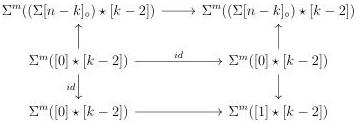

2.4. GLOBULAR EQUIVALENCES

of this lemma are sent by R to  \( (0,\omega) \) -categories with loop free and atomic basis and with no non-trivial automorphisms. Remark 2.4.4.7 implies that for one of these objects (resp. a morphism between them) to belong to C, it is sufficient to show that it is linked by a zigzag of acyclic cofibrations to the colimit, computed in  \( \mathrm{mPsh}(\Delta) \) , of a diagram with value in C (resp. in the arrow category of C).

As \(\Sigma[0]_{\circ} = [1]\), the case \((k - 1, k - 1)\) implies that the morphism

\[
\Sigma^ {m} (\{0 \} \star [ k - 1 ]) \to \Sigma^ {m} ([ 1 ] \star [ k - 1 ])
\]

is in \(C\). Combined with the case \((k - 1, n - 1)\), this implies that the diagram

is in \(C\), and so is it's vertical colimits. As the codomain is weakly equivalent to \(\Sigma^m((\Sigma[n - k]_{\circ} \vee [1]) \star [k - 2])\), this implies that \(C\) includes the canonical morphism

\[
\Sigma^ {m} ((\Sigma [ n - k ] _ {\circ}) \star [ k - 2 ]) \hookrightarrow \Sigma^ {m} ((\Sigma [ n - k ] _ {\circ} \vee [ 1 ]) \star [ k - 2 ]). \tag {2.4.4.9}
\]

We can show similarly that the canonical morphism

\[
\Sigma^ {m} ([ 1 ] \star [ k - 2 ]) \hookrightarrow \Sigma^ {m} ((\Sigma [ n - k ] _ {\circ} \vee [ 1 ]) \star [ k - 2 ]). \tag {2.4.4.10}
\]

is in \(C\).

The image by R of the canonical morphism

\[
\Sigma^ {m} ((\Sigma [ n - k ] _ {\circ} \vee [ 1 ]) \star [ k - 2 ]) \to \Sigma^ {m} ((\Sigma [ n - k ] _ {\circ}) \star [ k - 2 ])
\]

induced by the retraction \(\Sigma[n - k]_{\circ} \vee [1] \to \Sigma[n - k]_{\circ}\) fulfills the condition of lemma 2.4.4.5 and then belongs to \(C\). The lemma 2.4.4.4 then implies that the morphism

\[
\Sigma^ {m} (\nabla \star [ k - 2 ]): \Sigma^ {m} ((\Sigma [ n - k ] _ {\circ}) \star [ k - 2 ]) \to \Sigma^ {m} ((\Sigma [ n - k ] _ {\circ} \vee [ 1 ]) \star [ k - 2 ]) (2. 4. 4. 1 1)
\]

is in \( C \). We will use freely in the rest of the proof that morphisms (2.4.4.9), (2.4.4.10) and (2.4.4.11) are in \( C \).

Theorem 2.3.2.1 implies that the object \(\Sigma^m (\Sigma [n - k]_{\circ}\star [k - 1])\) is linked by a zigzag of acyclic cofibrations to the colimit of

\[
\Sigma^ {m} ((\Sigma [ n - k ] _ {\circ} \vee [ 1 ]) \star [ k - 2 ]) \gets \Sigma^ {m} (\Sigma [ n - k ] _ {\circ} \star [ k - 2 ]) \to \Sigma^ {m} (\Sigma [ n - k + 1 ] _ {\circ} \star [ k - 2 ])
\]

107