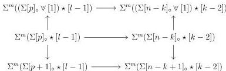
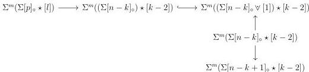
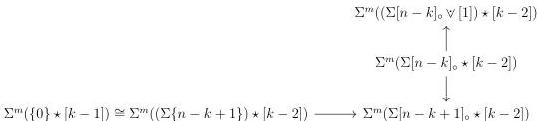

CHAPTER 2. STUDY OF THE COMPLICIAL MODEL

and the induction hypothesis implies that it belongs to $C$. We proceed similarly to show that $\Sigma^m([k-1]_\circ \stackrel{co}{\star} \Sigma[n-k])$ belongs to $C$.

Let $0 \leq l \leq k-1$ and $-1 \leq p \leq n-k$ be two integers, and $f : [l] \to [k-1]$ and $g : [p] \to [n-k]$ be two monomorphisms. Suppose first that $f$ is of shape $[0] \star f'$ for $f' : [l-1] \to [k-2]$. In this case, $\Sigma^m(\Sigma[p]_\circ \star [l]) \to \Sigma^m(\Sigma[n-k]_\circ \star [k-1])$ is linked by a zigzag of acyclic cofibrations to the vertical colimit of the diagram

and the induction hypothesis implies that it belongs to $C$. Suppose now that $f$ avoids the initial object of $[k-1]$. In this case, the morphism $\Sigma^m(\Sigma[p]_\circ \star [l]) \to \Sigma^m(\Sigma[n-k]_\circ \star [k-1])$ is linked by a zigzag of acyclic cofibrations to the vertical colimit of the diagram

and the induction hypothesis implies that it belongs to $C$. We prove similarly that

$$\Sigma^m([l]_\circ \stackrel{co}{\star} \Sigma[p]) \to \Sigma^m([k-1]_\circ \stackrel{co}{\star} \Sigma[n-k])$$

belongs to $C$.

The morphism $\Sigma^m(\{0\} \star [k-1]) \to \Sigma^m(\Sigma[n-k]_\circ \star [k-1])$ is linked by a zigzag of acyclic cofibrations to the vertical colimit of the diagram

and the induction hypothesis implies that it belongs to $C$. The morphism $\Sigma^m(\{1\} \star [k-1]) \to \Sigma^m(\Sigma[n-k]_\circ \star [k-1])$ is linked by a zigzag of acyclic cofibrations to the vertical

108