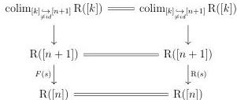

CHAPTER 2. STUDY OF THE COMPLICIAL MODEL

We proceed by induction and we then suppose that for any $0 < k \leq n$ and any degeneracy $s : [k] \rightarrow [k - 1]$, $F(s) = \mathrm{R}(s)$. As any morphism of $\Delta$ factors as a degeneracy followed by a monomorphism, the induction hypothesis implies that for any $f : [k] \rightarrow [n]$ with $k \leq n$, $F(f) = \mathrm{R}(f)$.

Let $s : [n + 1] \rightarrow [n]$ be a degeneracy. We have a *a priori* non commutative diagram:

The induction hypothesis implies that the outer and the upper square commute. As $R$ commutes with colimits, $\operatorname{colim}_{[k] \rightarrow \partial[n]} \mathrm{R}([k])$ is equivalent to $\mathrm{R}(\partial[n])$. Moreover, the inclusion $\mathrm{R}(\partial[n]) \rightarrow \mathrm{R}([n])$ induces an isomorphisms on cells of dimension lower or equal to $n$. For the lower square to commutes, we then only have to check that the top cell of $\mathrm{R}([n + 1])$ is sent on the same element on $\mathrm{R}([n])$. That is the case because the two paths send it to an unity as there is no non trivial $(n + 1)$-cells in $\mathrm{R}([n])$.

We then have $F(s) = \mathrm{R}(s)$, which concludes the induction and then the proof. $\square$

**Proposition 2.4.4.13.** *There exists an invertible natural transformation $\mathrm{R}i \rightarrow \mathrm{R}$.*

*Proof.* As $\Sigma[0]_\circ$ is isomorphic to $[1]$, the case $(n, n)$ for any integer $n$ of the lemma 2.4.4.8 imply that there exists an invertible transformation $\phi : (\mathrm{R}i)_{|\Delta} \rightarrow \mathrm{R}_{|\Delta}$ which is natural when restricted to the full subcategory of $\Delta$ whose morphisms are the monomorphisms.

The lemma 2.4.4.12 then implies that $\phi : (\mathrm{R}i)_{|\Delta} \rightarrow \mathrm{R}_{|\Delta}$ is natural. We can extend it to a natural transformation $\phi' : (\mathrm{R}i)_{|t\Delta} \rightarrow \mathrm{R}_{|t\Delta}$ thanks to the proposition 2.4.4.2.

Eventually, as both $\mathrm{R}i$ and $\mathrm{R}$ preserves colimits, we can extend $\phi'$ to a invertible natural transformation between $\mathrm{R}i$ and $\mathrm{R}$. $\square$

**Theorem 2.4.4.14.** *Let $i : \mathrm{mPsh}(\Delta) \rightarrow \mathrm{mPsh}(\Delta)$ be a left Quillen functor. Suppose that there exists a zigzag of weakly invertible natural transformations:*

$$i(\mathbf{D}_-) \rightsquigarrow \mathbf{D}_-.$$

*Then, there exists a zigzag of weakly invertible natural transformations between $i$ and $id$. In particular, $i$ is a left Quillen equivalence.*

*Proof.* The proposition 2.4.4.13 implies that we have a natural transformation $\psi : i \rightarrow i_{str}$. Furthermore, hypotheses imply that this natural transformation is a weak equivalence on

110