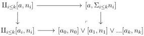
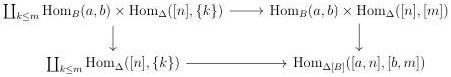

CHAPTER 3. COMPLICIAL SETS AS A MODEL OF \((\infty, \omega)\)-CATEGORIES

The assignation \((a, n) \mapsto [a, n]\) induces by left Kan extension a colimit preserving functor

\[
[ \_, \_ ]: A \times \mathrm{Psh} (\Delta) \to \mathrm{Seg} (A).
\]

The image of this functor is dense in \(\operatorname{Seg}(A)\).

For \(\{n_i\}_{i\leq k}\) and \(\{a\to a_i\}_{i\leq k}\) two finite sequences, we denote by \([a_0,n_0]\vee [a_1,n_1]\vee \ldots \vee [a_k,n_k]\) the Segal \(A\) -precategory fitting in the following pushout:

The case we will use the most is the one of the Segal \(A\)-precategories \([e,1] \vee [a,n]\) and \([a,n] \vee [e,1]\) corresponding to the sequence \(((1,n),(a \to e,a \to a))\) and \(((n,1),(a \to a,a \to e))\).

3.1.1.3. Let B be the Reedy category and M the subset of objects of B such that A is the category of M-stratified presheaves on B. We define the category  \( \Delta[B] \)  as the fully faithful subcategory of  \( \operatorname{Seg}(A) \)  whose objects are of shape  \( [b,n] \)  for  \( b\in B \)  and n an integer. Eventually, we define  \( \Delta[M] \)  as the set of objects of shape  \( [b,n] \)  for  \( b\in M \)  and n>0. We can easily check that the category  \( \operatorname{Seg}(A) \)  is the category of  \( \Delta[M] \) -stratified presheaves on  \( \Delta[B] \) .

A cellular model for  \( \operatorname{tSeg}(A) \)  is given by the set of morphisms  \( [b,\partial n]\cup[a,n]\to[b,n] \)  for n an integer, and  \( a\to b \)  a generating cofibration of A.

Eventually, for any Segal \(A\)-precategory \(C\), we have an isomorphism

\[
C \cong \underset {\Delta [ t B ] / C} {\mathrm{colim}} [ b, n ].
\]

Following the definition of section 2.1.2, a morphism between Segal precategories is entire if it is the identity on the underlying  \( \Delta[B] \) -presheaves.

Proposition 3.1.1.4. The category \(\Delta[B]\) as a structure of elegant Reedy category.

Proof. Remark first that \(\mathrm{Hom}_{\Delta [B]}([a,n],[b,m])\) fits in the following cocartesian square:

116