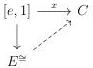

CHAPTER 3. COMPLICIAL SETS AS A MODEL OF \((\infty, \omega)\)-CATEGORIES

We can give an other characterization of isomorphisms in Segal A-categories. An arrow  \( x : [e, 1] \to C \)  is an isomorphism if and only if there exists a lifting in the following diagram:

A morphism  \( f : C \to D \)  between Segal A-categories is an equivalence of Segal A-categories if  \( C_{1} \to D_{1} \)  is a weak equivalence in A, and for any element  \( x \in ob(D) \) , there exists  \( y \in ob(C) \)  and an isomorphism in D between  \( f(y) \)  and x.

Theorem 3.1.1.7 ([Sim11, 21.2.1]). There exists a nice model structure on \(\operatorname{Seg}(A)\) where fibrant objects are Segal \(A\)-categories and weak equivalences between Segal \(A\)-categories are equivalences of Segal \(A\)-categories.

A left adjoint from  \( \operatorname{Seg}(A) \)  to a model category C is a left Quillen functor if it preserves cofibrations, and sends elementary anodyne extensions to weak equivalences.

Proposition 3.1.1.8. Any Segal A-precategory is a homotopy colimit of objects of shape  \( [a, n] \) .

Proof. Let \( C \) be a Segal \( A \)-precategory. We have \( C \cong \operatorname{colim}_{\Delta[tB]_C -} \). The result then follows from propositions 1.1.2.6, 2.1.2.3 and 3.1.1.4.

#### 3.1.2 Stratified Segal A-precategories

3.1.2.1. A stratified Segal \(A\)-precatagory is a pair \((C, tC)\) where \(tC\) is a subset of \(ob(C_1)\) that factors \(s^0: C_0 \to ob(C_1)\). A morphism of stratified Segal \(A\)-precatagory \((C, tC) \to (D, tD)\) is the data of a morphism \(f: C \to D\) such that \(f(tC) \subset tD\). The category of stratified Segal \(A\)-precategories is denoted by \(\mathrm{tSeg}(A)\).

We have an adjunction

\[
(\_) ^ {\flat}: \operatorname{Seg} (A) \xrightarrow [ \leftarrow ]{\perp} \mathrm{tSeg} (A): (\_) ^ {\natural} \tag {3.1.2.2}
\]

where the left adjoint is a fully faithful inclusion that sends C to  \( C^{\flat} := (C, Im(s^{0})) \) . The right adjoint is the obvious forgetful functor. We will identify Segal A-precategories with their images in stratified Segal A-precategories under the left adjoint.

3.1.2.3. We define  \( [e,1]_{t} := ([e,1], [e,1]_{1}) \) . The subcategory of objects of shape  \( [a,n] \)  or  \( [e,1]_{t} \)  is then dense in  \( \operatorname{tSeg}(A) \) .

Let \( B \) be the Reedy category and \( M \) the subset of objects of \( B \) such that \( A \) is the category of \( M \)-stratified presheaves on \( B \). We recall that we defined the category \( \Delta[B] \)

118