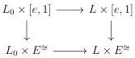
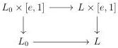
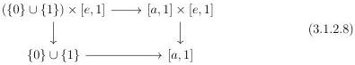

CHAPTER 3. COMPLICIAL SETS AS A MODEL OF \((\infty, \omega)\)-CATEGORIES

Lemma 3.1.2.7. Let \( i: K \to L \) be a cofibration that induces an isomorphism on objects. The morphism

\[
K \times E ^ {\cong} \coprod_ {K \times [ e, 1 ]} L \times [ e, 1 ] \to L \times E ^ {\cong}
\]

is an acyclic cofibration of the model strucure on \(\operatorname{Seg}(A)\).

Proof. By two out of three, and some diagram chasing, is it sufficient to demonstrate the result for \( K \) being \( L_0 \). We then have to show that the square

is homotopy coccartesian. As the model structure is cartesian, and as \( E^{\cong} \to 1 \) is a weak equivalence, this is sufficient to show that the following square is homotopy cocartesian:

As \(\_ \times [e,1]\) and \(\_ \times E^{\cong}\) are left Quillen functors, we can reduce to the case where \(L\) is \([a,n]\) and using Segal extension, to the case where \(L\) is \([a,1]\). We then have to show that the following square is homotopy cocartesian

Remark then that  \( [a,1]\times[e,1] \)  is the colimit of the following span:

\[
[ e, 1 ] \vee [ a, 1 ] \xleftarrow {[ a , d ^ {1} ]} [ a, 1 ] \xrightarrow {[ a , d ^ {1} ]} [ a, 1 ] \vee [ e, 1 ]
\]

The pushout of the span of (3.1.2.8) is then the (homotopy) colimit of

\[
[ 0 ] \coprod_ {[ e, 1 ]} [ e, 1 ] \vee [ a, 1 ] \xleftarrow {[ a , d ^ {1} ]} [ a, 1 ] \xrightarrow {[ a , d ^ {1} ]} [ a, 1 ] \vee [ e, 1 ] \coprod_ {[ e, 1 ]} [ 0 ]
\]

By two out of three, and using Segal extensions, the two morphisms

\[
[ 0 ] \coprod_ {[ e, 1 ]} [ e, 1 ] \vee [ a, 1 ] \to [ a, 1 ] \qquad \text {and} \qquad [ a, 1 ] \vee [ e, 1 ] \coprod_ {[ e, 1 ]} [ 0 ] \to [ a, 1 ]
\]

120