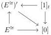

CHAPTER 3. COMPLICIAL SETS AS A MODEL OF \((\infty, \omega)\)-CATEGORIES

the trivial cofibrations \(\{0\} \to E^{\cong}\) and \(\{1\} \to E^{\cong}\). We denote \(I\) a cellular model for \(\mathrm{Psh}(t\Delta[tB])\).

As \(\mathrm{tSeg}(A)\) is the category of \(t\Delta [M]\) stratified presheaves on \(\Delta [B]\), we have an adjunction

\[
\pi : \mathrm{Psh} (t \Delta [ t B ]) \xrightarrow [ \leftarrow ]{\perp} \mathrm{tSeg} (A): \iota
\]

where the right adjoint is fully faithfull.

The set \( l(r(\iota(\mathrm{J})\hat{\times}I)) \) is a class of anodyne extension relative to the interval \( _- \times E^{\cong} \) as defined in [Cis06, paragraph 1.3.12]. We then consider \( \mathrm{Psh}(t\Delta[tB]) \) endowed with the model structure induced by [Cis06, théorème 1.3.22]. An object is fibrant if and only if it has the right lifting property against \( \iota(\mathrm{J})\hat{\times}I \). A morphism between fibrant objects is a fibration if and only if it has the right lifting property against \( \iota(\mathrm{J})\hat{\times}I \).

According to proposition 2.1.2.6, this induces a model structure on  \( \operatorname{tSeg}(A) \) . By adjunction and using lemma 3.1.2.9, an object is fibrant if and only if it has the right lifting property against J and a morphism between fibrant objects is a fibration if and only if it has the right lifting property against J. According to lemma 3.1.2.6, the fibrant objects correspond to marked Segal A-categories.

The theorem 3.1.1.7 implies that the adjunction (3.1.2.2) is a Quillen adjunction. It's unit is the identity, and lemma 3.1.2.6 implies that the counit, computed on a fibrant object \((C,C^{\cong})\), is the canonical inclusion \((C,C^{\flat})\to (C,C^{\cong})\). As this morphism is a transfinite composite of \(E^{\cong}\rightarrow (E^{\cong})'\), it is a weak equivalence. The Quillen pair 3.1.2.6 is then a Quillen equivalence. As a consequence, the model structure on \(\mathrm{tSeg}(A)\) is cartesian and simplicial, and weak equivalences between fibrant objects are stratified equivalences.

It then remains to prove the last assertion. Suppose given a left adjoint \( F: \mathrm{tSeg}(A) \to C \) that preserves cofibrations, and sends elementary anodyne extensions and morphisms \( [e,1]_t \to 1 \), \( E^{\cong} \to (E^{\cong})' \) to weak equivalences. The theorem 3.1.1.7 implies that the restriction of \( F \) to \( \operatorname{Seg}(A) \) is a left Quillen functor, and this functors then sends any acyclic cofibration of \( \operatorname{Seg}(A) \) to a weak equivalence. As we have a commutative diagram,

we deduce by two out of three that \( F \) sends \( [1]_t \to (E^{\cong})' \) to a weak equivalence. The functor \( F \) then sends any morphism of \( J \) to a weak equivalence.

As fibrant objects and fibrations between fibrant objects are detected by right lifting property against J, the right adjoint of F preserves them. The corollary A.2 of [Dug01] implies that F is a left Quillen functor. □

122