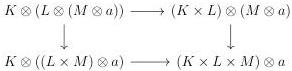
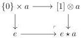

CHAPTER 3. COMPLICIAL SETS AS A MODEL OF \((\infty, \omega)\)-CATEGORIES

(as defined in paragraph 2.1.1.8). We suppose furthermore that the terminal element of \( A \), denoted by \( e \), is representable. We also suppose that \( A \) is endowed with intelligent \( n \)-truncation for any \( n \in \mathbb{N} \cup \{\omega\} \), i.e a family of left Quillen functors \( \tau_{-}^{i}: (\mathbb{N} \cup \{\omega\})^{op} \to \operatorname{End}(A) \) such that

- \(\tau_{\omega}^{i} = id,\)
- for any \(n \leq m\), \(\tau_{n}^{i}\tau_{m}^{i} = \tau_{n}^{i}\),
- for any \(n \leq m\), the natural transformation \(\tau_{m}^{i} \to \tau_{n}^{i}\) is an entire monomorphism,

and a left Quillen bifunctor \(\_ \otimes \_ : \mathrm{tPsh}(\Delta)^1 \times A \to A\) such that

- for \( K \) and \( L \) two stratified simplicial sets, and \( a \in A \), there is a morphism \( K \otimes (L \otimes a) \to (K \times L) \otimes a \) natural in \( K, L \) and \( a \), such that the following square commutes

for any stratified simplicial sets \(M\).

- The functor \([0] \otimes \_ : A \to A\) is the identity.
- For any integer \( n \), for any object \( a \) invariant under \( \tau_n^i \), and for any stratified simplicial set \( K \), the object \( K \otimes a \) is invariant under \( \tau_{n+1}^i \).

Here, the model category  \( \mathrm{tPsh}(\Delta)^{1} \)  corresponds to the model structure for 1-complicial sets on stratified simplicial sets given in theorem 2.2.1.6.

##### 3.1.3.2. We define \( e \star a \) as the pushout:

We consider the natural transformations  \( s^{0} \star a : e \star e \star a \to e \star a \)  and  \( d^{0} \star a : a \to e \star a \) , induced respectively by the morphism

\[
\begin{array}{l} [ 1 ] \otimes [ 1 ] \otimes a \rightarrow ([ 1 ] \times [ 1 ]) \otimes a \rightarrow [ 1 ] \otimes a \\ (\{i \} \times \{j \}) \otimes a \mapsto \{i \wedge j \} \otimes a. \\ \end{array}
\]

and the morphism

\[
\{1 \} \otimes a \rightarrow [ 1 ] \otimes a.
\]

124