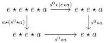
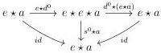
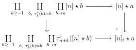

3.1. PRELIMINARIES

These natural transformations induce commutative diagrams:

The (inverted) composition $g, f \mapsto g \circ f$ is a monoidal structure on the category of endomorphisms of $A$ and the natural transformation $s^0 : e \star e \star \_ \to e \star \_$ defines a structure of monoid for $e \star \_$ . This induces a functor $\Delta \times A \to A$ sending $([n], a)$ to $e \star e \star \ldots \star a$. We extend this to a functor $\Delta_t \times A \to A$ in defining $[n]_t \star a$ as the pushout:

where $\tau_{-1}^{i}$ is the constant functor with value $\emptyset$.

3.1.3.3. Such model category $A$ is a Gray module if for any $a$, the induced functor $\_ \star a : \Delta_t \to A_{a/}$ lifts to a left Quillen functor $\_ \star a : \mathrm{tPsh}(\Delta)^\omega \to A_{a/}$.

We recall that $\mathrm{tPsh}(\Delta)^\omega$ denotes the model structure for $\omega$-complicial sets given in theorem 2.2.1.6.

For the rest of this chapter, we fix a Gray module $A$. For a stratified simplicial set $K \in \mathrm{tPsh}(\Delta)$, the object $K \star \emptyset \in A$ is simply noted by $K$.

Remark 3.1.3.4. In general, $[n] \otimes e$ and $[n] \star \emptyset$ are two very different objects. Indeed $[n] \otimes e$ has to be invariant up to homotopy under $\tau_1^i$ which is not the case for $[n] \star \emptyset$. Analogously $[k] \otimes ([l] \otimes [a])$ and $([k] \otimes [l]) \otimes [a]$ have a priori no links. When we write $[n_0] \otimes [n_1] \otimes ..[n_k] \otimes a$, we will always mean $[n_0] \otimes ([n_1] \otimes ..([n_k] \otimes a))$.

Example 3.1.3.5. For any $d \in \mathbb{N} \cup \{\omega\}$, the model category $\mathrm{tPsh}(\Delta)^d$, corresponding to the model structure for $d$-complicial sets on stratified simplicial sets, and where $K \otimes L := \tau_1^i(K) \boxtimes L$, is an example of Gray module.

Indeed, if $n$ is any integer, we define $[n]^\diamond := [0] \diamond [0] \diamond \ldots \diamond [0]$ and $[n]_t^\diamond := \tau_n^i([n]^\diamond)$. This induces a colimit preserving functor $K \mapsto K^\diamond$. The join coming from $\tau_1^i(\_) \boxtimes \_$ then corresponds to the functor $(K, L) \mapsto K^\diamond \diamond L$. The proposition 2.2.2.15 provides a natural transformation $K^\diamond \diamond L \to K \star L$, wich implies that the first functor is left Quillen.

125