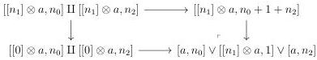
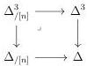
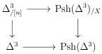

CHAPTER 3. COMPLICIAL SETS AS A MODEL OF \((\infty, \omega)\)-CATEGORIES

### 3.2 Gray constructions for stratified Segal A-categories

We now construct a Gray cylinder and a Gray cone on  \( \operatorname{tSeg}(A) \) , using the structure of Gray module that A has. We denote by  \( \Delta_{+} \) the augmented simplex category and  \( d^{0} \)  the unique morphism  \( \emptyset \to [0] \) .

#### 3.2.1 Gray cylinder

##### 3.2.1.1. We define the functor

\[
\Delta^ {3} \times A \quad \rightarrow \operatorname{Seg} (A)
\]

\[
[ n _ {0} ], [ n _ {1} ], [ n _ {2} ], a \mapsto [ a, n _ {0} ] \vee [ [ n _ {1} ] \otimes a, 1 ] \vee [ a, n _ {2} ]
\]

where \([a, n_0] \vee [[n_1] \otimes a, 1] \vee [a, n_2]\) fits in the following pushout:

If \(n\) is an integer, \(\Delta_{/[n]}^{3}\) is the pullback:

where the right hand functor sends \(\left([n_0],[n_1],[n_2]\right)\) to \([n_0]\star [n_1]^{op}\star [n_2]\).

Proposition 3.2.1.2. The category \(\Delta_{/[n]}^{3}\) is an elegant Reedy category.

Proof. We denote \(X\) the trisimplicial set whose value on \([n_0], [n_1], [n_2]\) is \(\mathrm{Hom}_{\Delta}([n_0] \star [n_1]^{op} \star [n_2], [n])\). The category \(\Delta_{/[n]}^3\) fits in the pullback

and is then an elegant Reedy category according to proposition 1.1.2.6.

□

126