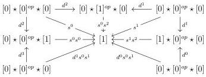

3.2. GRAY CONSTRUCTIONS FOR STRATIFIED SEGAL A-CATEGORIES

##### 3.2.1.3. We define the functor

\[
A \times \Delta \rightarrow \operatorname{Seg} (A)
\]

\[
[ n ], a \mapsto F (a, n)
\]

by the formula \( F(a, n) := \underset{\Delta_{\gamma[n]}^3}{\text{colim}} [a, n_0] \vee [[n_1] \otimes a, 1] \vee [a, n_2] \).

In order to extend this functor to stratified Segal \(A\)-precategories with construction 3.1.2.13, we will need to define the value on \([e,1]_t\), i.e. to choose an object \(F(e,1)'\) and an entire cofibration \(F(e,1) \to F(e,1)'\). It will be useful to have a more explicit description of this object.

Example 3.2.1.4. The sub-category of \(\Delta_{\gamma[1]}^3\) composed of non degenerate objects can be pictured by the graph:

The Segal A-precategory  \( F(e,1) \)  is then the colimit of the following diagram:

\[
[ e, 2 ] \xleftarrow {[ e , d ^ {1} ]} [ e, 1 ] \xrightarrow {[ d ^ {0} , 1 ]} [ [ 1 ], 1 ] \xleftarrow {[ d ^ {1} , 1 ]} [ e, 1 ] \xrightarrow {[ e , d ^ {1} ]} [ e, 2 ]
\]

##### 3.2.1.5. We define the functor

\[
I \otimes \_ : \mathrm{tSeg} (A) \to \mathrm{tSeg} (A)
\]

induced, as in the construction 3.1.2.13, by \( F \) and with \( F(e,1)' \) as the colimit of the following diagram:

\[
[ e, 1 ] _ {t} \longleftarrow [ e, 1 ] \stackrel {[ e, d ^ {2} ]} {\longrightarrow} [ e, 2 ] \stackrel {[ e, d ^ {1} ]} {\longleftarrow} [ e, 1 ] \stackrel {[ d ^ {0}, 1 ]} {\longrightarrow} [ [ 1 ] _ {t}, 1 ] \stackrel {[ d ^ {1}, 1 ]} {\longleftarrow} [ e, 1 ] \stackrel {[ e, d ^ {1} ]} {\longrightarrow} [ e, 2 ] \stackrel {[ e, d ^ {0} ]} {\longleftarrow} [ e, 1 ] \longrightarrow [ e, 1 ] _ {t}
\]

The two objects of \(\Delta_{[n]}^3\), \(s^n s^{n+1} : [n] \star [0]^{op} \star [0] \to [n]\) and \(s^0 s^0 : [0] \star [0]^{op} \star [n] \to [n]\), induce two morphisms: \(d^1 \otimes [a, n] : \{0\} \otimes [a, n] := [a, n] \hookrightarrow [a, n] \vee [e, 1] \to I \otimes [a, n]\) and \(d^0 \otimes [a, n] : \{1\} \otimes [a, n] := [a, n] \hookrightarrow [e, 1] \vee [a, n] \to I \otimes [a, n]\). By extending them by colimits we get two maps

\[
d ^ {1} \otimes C: \{0 \} \otimes C := C \to I \otimes C \quad \text { and } \quad d ^ {0} \otimes C: \{1 \} \otimes C := C \to I \otimes C.
\]

127