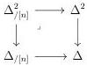
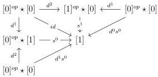

3.2. GRAY CONSTRUCTIONS FOR STRATIFIED SEGAL A-CATEGORIES

If $n$ is an integer, $\Delta_{/[n]}^2$ is the pullback:

where the right hand functor sends $([n_0], [n_1])$ to $[n_0]^{op} \star [n_1]$.

**Proposition 3.2.2.2.** *The category $\Delta_{/[n]}^2$ is an elegant Reedy category.*

*Proof.* The proof is analogue to the one of proposition 3.2.1.2.

### 3.2.2.3. We define the functor

$$A \times \Delta \rightarrow \operatorname{Seg}(A)$$

$$[n], a \mapsto H(a, n)$$

by the formula $H(a, n) := \operatorname{colim}_{\Delta_{/[n]}^2} [[n_0] \otimes a, 1] \vee [a, n_1]$.

In order to extend this functor to stratified Segal $A$-precategories with construction 3.1.2.13, we will need to define the value on $[e, 1]_t$, i.e. to choose an object $H(e, 1)'$ and an entire cofibration $H(e, 1) \to H(e, 1)'$. It will be useful to have a more explicit description of this object.

**Example 3.2.2.4.** The sub-category of $\Delta_{/[1]}^2$ composed of non degenerate objects can be pictured by the graph:

The Segal $A$-precategory $H(e, 1)$ is then the colimit of the following diagram:

$$[e, 2] \xleftarrow{[e, d^1]} [e, 1] \xrightarrow{[d^0, 1]} [[1], 1]$$

### 3.2.2.5. We define the functor

$$e \star \_ : \operatorname{tSeg}(A) \to \operatorname{tSeg}(A)$$

129