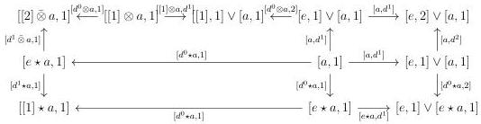

CHAPTER 3. COMPLICIAL SETS AS A MODEL OF \((\infty, \omega)\)-CATEGORIES

induced, as in the construction 3.1.2.13 by \( H \) and with \( H(e,1)' \) as the colimit of the following diagram:

\[
[ e, 1 ] _ {t} \longleftarrow [ e, 1 ] \xrightarrow {[ e , d ^ {0} ]} [ e, 2 ] \xleftarrow {[ e , d ^ {1} ]} [ e, 1 ] \xrightarrow {[ d ^ {0} , 1 ]} [ [ 1 ] _ {t}, 1 ]
\]

The object  \( s^{0}:[0]^{op}\star[n]\to[n] \)  induces a composite morphism  \( d^{0}\star[a,n]:\emptyset\star[a,n]:=[a,n]\hookrightarrow[1,1]\vee[a,n]\to e\star[a,n] \) , which induces by extension by colimit a natural transformation

\[
d ^ {0} \star C: \emptyset \star C := C \to e \star C.
\]

Proposition 3.2.2.6. The Segal A-precategory  \( e \star [a,1] \)  is the colimit and the homotopy colimit of the following diagram:

\[
[ e, 1 ] \vee [ a, 1 ] \xleftarrow {[ e , d ^ {1} ]} [ a, 1 ] \xrightarrow {[ d ^ {0} \star a , 1 ]} [ e \star a, 1 ]
\]

Proof. We have already given the description of \(\Delta_{/[1]}^2\) in the example 3.2.2.4. The Segal \(A\)-precategory \(H(a,1)\) is the colimit of the following diagram:

\[
[ a, 2 ] \xleftarrow {[ e , d ^ {1} ]} [ a, 1 ] \xrightarrow {[ d ^ {0} \otimes a , 1 ]} [ [ 1 ] \otimes a, 1 ]
\]

and  \( e \star [a,1] \)  is the colimit of the given diagram. As all the morphisms are cofibrations, this colimit is a homotopy colimit. ☐

Remark 3.2.2.7. Using again notations of remark 3.2.1.7, if C is an  \( (0,\omega) \) -category, the  \( (0,\omega) \) -category  \( e\star C \)  is the colimit of the following diagram:

\[
[ e, 1 ] \vee [ C, 1 ] \xleftarrow {\nabla} [ C, 1 ] \xrightarrow {[ d ^ {0} \star C , 1 ]} [ e \star C, 1 ]
\]

where  \( \nabla \)  is the whiskering. Our definition of the join is therefore analogous to that of the strict world.

Proposition 3.2.2.8. The Segal A-precategory  \( [1] \star [a,1] \)  is the colimit of the following diagram:

130