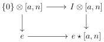
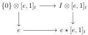
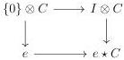
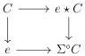

CHAPTER 3. COMPLICIAL SETS AS A MODEL OF \((\infty, \omega)\)-CATEGORIES

is a weak equivalence. As \(\Delta_{/[n]}^{3}\) is Reedy elegant, this induces a weak equivalence

\[
\underset {\Delta_ {[ n ]} ^ {3}} {\operatorname{colim}} [ a, n _ {0} ] \vee [ [ n _ {1} ] \otimes a, 1 ] \vee [ a, n _ {2} ] _ {/ [ a, n _ {0} ]} \to \underset {\Delta_ {[ n ]} ^ {3}} {\operatorname{colim}} [ [ n _ {1} ] \otimes a, 1 ] \vee [ a, n _ {2} ].
\]

Remark furthermore that the left hand object is equivalent to  \( (I \otimes [a, n])_{/\{0\} \otimes [a, n]} \)  and the right one to  \( H(a, n) \) . As the construction 3.1.2.13 preserves weakly invertible natural transformations between functors that preserve cofibration, this induces a weakly invertible natural transformation  \( (I \otimes [a, n])_{/\{0\} \otimes [a, n]} \to e \star [a, n] \) . This directly implies that squares

are homotopy cocartesian. As every stratified Segal \(A\)-precategory is a homotopy colimit of objects of shape \([a, n]\) and \([e, 1]_t\), and as \(I \otimes_{-}\) and \(e \star_{-}\) preserves monomorphisms, this implies the following proposition:

Proposition 3.2.3.2. For any stratified Segal \(A\)-precategory \(C\), the natural transformation \(I \otimes_{-} \to e \star_{-}\) fits into a homotopy cocartesian square:

##### 3.2.3.3. We define the functor

\[
A \times \Delta \rightarrow \operatorname{Seg} (A)
\]

\[
[ n ], a \mapsto T (a, n)
\]

by the formula \( T(a, n) := [[n] \otimes a, 1] \).

Eventually we define the functor \(\Sigma^{\circ}[a,n]:\mathrm{tSeg}(A)\to \mathrm{tSeg}(A)\) induced, as in the construction 3.1.2.13, by \(T\) and with \(T(e,1):= [[1]_t\otimes e,1]\). This functor is called the \(\circ\)-suspension. With a proof similar to the on of proposition 3.2.3.2, one can show:

Proposition 3.2.3.4. There exists a natural transformation \( e \star_{-} \to \Sigma^{\circ}(_{-}) \) such that for any marked Segal \( A \)-precategory \( C \), \( e \star C \to \Sigma^{\circ}C \) induces a homotopy cocartesian square:

132