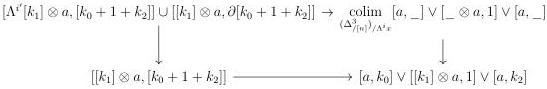
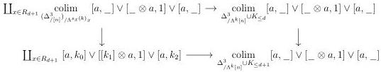

CHAPTER 3. COMPLICIAL SETS AS A MODEL OF \((\infty, \omega)\)-CATEGORIES

where the left-hand morphism is an acyclic cofibration. The case where the image of i is in  \( [k_{2}] \)  is similar. Suppose now that i lands in  \( [k_{1}] \) . We then define  \( i' := i - k_{0} - 1 \) , and there is a cocartesian square:

where the left-hand morphism is an acyclic cofibration.

Lemma 3.2.4.4. Let \(0 < k < n\) be two integers. The morphism

\[
\underset {\Delta_ {/ \Lambda^ {k} [ n ]} ^ {3} \cup K _ {\leq d}} {\text {colim}} [ a, \_ ] \vee [ \_ \otimes a, 1 ] \vee [ a, \_ ] \to \underset {\Delta_ {/ \Lambda^ {k} [ n ]} ^ {3} \cup K _ {\leq d + 1}} {\text {colim}} [ a, \_ ] \vee [ \_ \otimes a, 1 ] \vee [ a, \_ ]
\]

is an acyclic cofibration

Proof. For  \( x := [k_{0}] \star [k_{1}]^{op} \star [k_{2}] \to [n] \)  a regular element of degree  \( d + 1 \) , we denote by  \( s_{x} \)  the section of x that avoids  \( k_{0} + 1 \)  and  \( k_{0} + k_{1} + 1 \) . We denote  \( R_{d+1} \)  the set of regular elements of degree  \( d + 1 \) . We claim that we have a cocartesian square

\[
\begin{array}{c} \coprod_ {x \in R _ {d + 1}} (\Delta_ {/ [ n ]} ^ {3}) _ {/ \Lambda^ {s _ {k} (x)} x} \longrightarrow \Delta_ {/ \Lambda^ {k} [ n ]} ^ {3} \cup K _ {\leq d} \\ \Biggl \downarrow \quad \Biggl \downarrow \\ \coprod_ {x \in R _ {d + 1}} (\Delta_ {/ [ n ]} ^ {3}) _ {/ x} \longrightarrow \Delta_ {/ \Lambda^ {k} [ n ]} ^ {3} \cup K _ {\leq d + 1} \end{array} \tag {3.2.4.5}
\]

This will induce a cocartesian square:

where the left vertical morphism is an acyclic cofibration according to lemma 3.2.4.3, which will conclude the proof.

We then have to justify the cocartesianess of the square (3.2.4.5). We denote by \(D\) the colimit of the underlying span of this square and \(\psi : D \to \Delta_{/\Lambda^k [n]}^3 \cup K_{\leq d + 1}\) the induced morphism. We will construct an inverse \(\phi\) of this functor.

Let \( x:[k_0]\star [k_1]^{op}\star [k_2]\to [n] \) be an element of \( \Delta_{/[n]}^3 \) of degree \( (d + 1) \). We denote by \( x_{r} \) the regular element characterized by the triple \( (x(k_{1}),d + 1,n - x(k_{0} + k_{1} + 1)) \). There is a

134