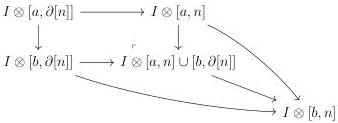

3.2. GRAY CONSTRUCTIONS FOR STRATIFIED SEGAL A-CATEGORIES

unique morphism $x \to x_r$. Furthermore, for any other regular element $x'$, $\operatorname{Hom}(x, x') = \emptyset$. We then set

$$\phi(x) := x \to x_r \in (\Delta^3_{/[n]})_{/x_r}.$$

If $x : [k_0] \star [k_1]^{op} \star [k_2] \to [n]$ is an element of $\Delta^3_{/\Lambda^k[n]}$, we set

$$\phi(x) := x \in \Delta^3_{/\Lambda^k[n]} \cup K_{\le d}.$$

To justify that this is well defined, remark that for any object $x$ of $\Delta^3_{\Lambda^k[n]}$ of degree $d+1$, the morphism $x \to x_r$ factors through $\Lambda^{s_k(x_r)}x_r$. This assignation lifts to a functor $\phi : \Delta^3_{/\Lambda^k[n]} \cup K_{\le d+1} \to D$ that is an inverse of $\psi$.

**Proposition 3.2.4.6.** *The morphism $I \otimes ([a, 1] \cup [a, 1] \cup ... \cup [a, 1]) \to I \otimes [a, n]$ is an acyclic cofibration.*

*Proof.* Let $0 < k < n$ be two integers. Let's demonstrate first that morphisms $I \otimes [a, \Lambda^k[n]] \to I \otimes [a, n]$ are acyclic cofibrations. We set

$$P_d := \underset{\Delta^3_{/\Lambda^k[n]} \cup K_{\le d}}{\operatorname{colim}} [a, \_] \vee [\_ \otimes a, 1] \vee [a, \_].$$

According to lemma 3.2.4.4, we have a sequence of acyclic cofibrations $I \otimes [a, \Lambda^k[n]] = P_0 \to P_1... \to P_n = I \otimes [a, n]$. This implies that the functor $I \otimes [a, \_] : \operatorname{Psh}(\Delta) \to \operatorname{tSeg}(A)$ sends inner anodyne extensions to weak equivalences.

Eventually, proposition 3.7.4 of [Cis19] states that the inclusion $[1] \cup ... \cup [1] \cup [1] \to [n]$ is an inner anodyne extension, which concludes the proof.

**Lemma 3.2.4.7.** *Let $a \to b$ be a generating acyclic cofibration. The morphism $I \otimes ([a, n] \cup [b, \partial[n]]) \to I \otimes [b, n]$ is an acyclic cofibration.*

*Proof.* It is obvious that $I \otimes [a, n] \to I \otimes [b, n]$ is an acyclic cofibration. As $I \otimes [\_, \partial[n]]$ is the homotopy colimit of element of shape $I \otimes [\_, [k]]$, the morphism $I \otimes [a, \partial[n]] \to I \otimes [b, \partial[n]]$ also is an acyclic cofibration. Now, we consider the diagram:

By stability of acyclic cofibration by pushouts and by two out of three, this implies the result.

135