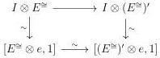
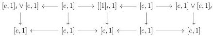

CHAPTER 3. COMPLICIAL SETS AS A MODEL OF \((\infty, \omega)\)-CATEGORIES

Lemma 3.2.4.8. The morphism \( I \otimes E^{\cong} \to I \otimes (E^{\cong})' \) is an acyclic cofibration.

Proof. First of all, remark that  \( E^{\cong} \to [0] \)  is a weak equivalence in  \( \operatorname{tSeg}(A) \) . According to the proposition 3.2.3.2, we then have a commutative square:

where all arrows labelled by  \( \sim \)  are weak equivalences. By two out of three, this implies the result.

Lemma 3.2.4.9. The morphism \( I \otimes [e,1]_t \to I \otimes e \) is a weak equivalence.

Proof. This morphism is the horizontal colimit of the diagram

As all the vertical morphisms are weak equivalences, and as these colimits are homotopy colimits, this concludes the proof.

Proposition 3.2.4.10. The functor \( I \otimes \_ : \mathrm{tSeg}(A) \to \mathrm{tSeg}(A) \) is a left Quillen functor.

Proof. It is obvious that this functor preserves cofibrations. Proposition 3.2.4.6 and lemmas 3.2.4.7, 3.2.4.8 and 3.2.4.9 imply that it sends elementary anodyne extensions, and morphisms \( E^{\cong} \to (E^{\cong})' \), \( [e,1]_t \to 1 \) to weak equivalences. According to proposition 3.1.2.10, this implies the result.

Corollary 3.2.4.11. The functor \( e \star \_ : \mathrm{tSeg}(A) \to \mathrm{tSeg}(A)_{e/} \) is a left Quillen functor.

Proof. First of all, it is obvious that this functor preserves cofibrations. It is then enough to show that it preserves weak equivalences. Proposition 3.2.3.2 implies that \( e \star \_ \) is the homotopy colimit of the diagram of functors \( e \leftarrow id \xrightarrow{\mathrm{i}_0} I \otimes \_ \). Each of these functors preserves weak equivalences, and so does \( e \star \_ \).

### 3.3 Quillen Adjunction with tPsh(Δ)

The purpose of this section is to construct a Quillen adjunction

\[
\mathrm{tPsh} (\Delta) \xrightarrow [ \leftarrow ]{\perp} \mathrm{tSeg} (A)
\]

136