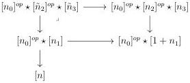
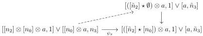

CHAPTER 3. COMPLICIAL SETS AS A MODEL OF \((\infty, \omega)\)-CATEGORIES

where we set the convention  \( [-1] = \emptyset \) . This induces a cartesian square

We consider the morphism \( j:[n_2]\otimes [n_0]\otimes a\to ([n_2]\times [n_0])\otimes a\to ([\tilde{n}_2]\star [n_0])\otimes a \) where the right-hand morphism sends \( \{(k,l)\} \otimes a \) to \( (\{k\} \star \emptyset)\otimes a \) if \( k\leq \tilde{n}_2 \) and to \( (\emptyset \star \{l\})\otimes a \) if not. The inclusion \( [\tilde{n}_3]\to [n_3] \) induces an inclusion \( i:[1 + \tilde{n}_3]\to [1 + n_3] \). We denote \( r \) the unique retraction of this inclusion that verifies \( r(k) = 0 \) if \( k\notin Im(i) \). Put together, \( j \) and \( r \) induce a morphism:

\[
\psi_ {x}: [ [ n _ {2} ] \otimes [ n _ {0} ] \otimes a, 1 ] \vee [ [ n _ {0} ] \otimes a, n _ {3} ] \rightarrow [ ([ \tilde {n} _ {2} ] \star [ n _ {0} ]) \otimes a, 1 ] \vee [ a, \tilde {n} _ {3} ]
\]

where we set the convention  \( \left[\left(\left[\tilde{n}_{2}\right]\star\left[n_{0}\right]\right)\otimes a,1\right]\vee\left[a,-1\right]:=[0] \) .

Remark that if \([n_2]^{op} \star [n_3] \to [1 + n_1]\) factors through \([n_1] \to [1 + n_1]\), we have \(\tilde{n}_2 = n_2\) and \(\tilde{n}_3 = n_3\), and a unique arrow fitting in a commutative triangle

Considering the canonical morphism

\[
[ ([ \tilde {n} _ {2} ] \star [ n _ {0} ]) \otimes a, 1 ] \vee [ a, \tilde {n} _ {3} ] \rightarrow e \star [ a, n ]
\]

if \(\tilde{n}_3\geq 0\) (coming from the fact that \(([n_0]^{op}\star [\tilde{n}_2]^{op})\star [\tilde{n}_3]\to [n]\) is an element of \(\Delta_{[n]}^2\)), and the morphism

\[
[ ([ \tilde {n} _ {2} ] \star [ n _ {0} ]) \otimes a, 1 ] \vee [ a, \tilde {n} _ {3} ] \rightarrow e \star \emptyset \rightarrow e \star [ a, n ]
\]

if \(\tilde{n}_3 = -1\), this induces a natural transformation

\[
H ^ {s ^ {0}} (a, n): H ^ {2} (a, n) \to e \star [ a, n ]
\]

induced by \(\psi_{-}\) on \(\underset{\Delta_{j[n]}^{2}}{\mathrm{colim}}\underset{\Delta_{j[1 + n_{1}]}^{2}}{\mathrm{colim}}\left[[n_{2}]\otimes [n_{0}]\otimes a,1\right]\vee [[n_{0}]\otimes a,n_{3}]\) and by the identity on \(\underset{\Delta_{j[n]}^{2}}{\mathrm{colim}}\left[[n_{2}]\otimes a,1\right]\vee [a,n_{3}]\).

138