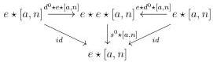
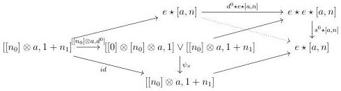
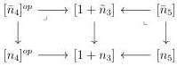

CHAPTER 3. COMPLICIAL SETS AS A MODEL OF \((\infty, \omega)\)-CATEGORIES

Proof. This is an easy proof by induction, after remarking that

\[
[ [ n _ {0} ] \otimes a, 1 + n _ {1} ] \rightarrow [ [ n _ {0} ] \otimes a, 1 ] \vee [ a, n _ {1} ]
\]

is an epimorphism.

Lemma 3.3.1.4. The following triangles commute:

Proof. We will prove only the left triangle and we leave the other to the reader. Let  \( x := ([n_{0}]^{op} \star [n_{1}] \to [n], [n_{2}]^{op} \star [n_{3}] \to [1 + n_{1}]) \)  be an element of  \( \operatorname{colim}_{\Delta_{/[n]}^{2}} \Delta_{/[1+n_{1}]}^{2} \) . We have a diagram:

where we know that everything except the right triangle commutes. As this is true for any x, lemma 3.3.1.3 implies the desired commutativity. □

Lemma 3.3.1.5. The following square commutes

\[
\begin{array}{c} e \star e \star e \star [ a, n ] \xrightarrow {s ^ {1} \star e \star [ a , n ]} e \star e \star [ a, n ] \\ e \star s ^ {1} \star [ a, n ] \Big \downarrow \qquad \qquad \qquad \qquad \qquad \qquad \qquad \qquad \qquad \qquad \qquad \qquad \qquad \qquad \qquad \qquad \qquad \qquad \qquad \qquad \qquad \qquad \qquad \qquad \qquad \qquad \qquad \qquad \qquad \qquad \qquad \qquad \qquad \qquad \\ e \star e \star [ a, n ] \xrightarrow [ s ^ {1} \star [ a , n ] ]{} e \star [ a, n ] \end{array}
\]

Proof. Let  \(  x = (f : [n_{0}]^{op} \star [n_{1}] \to [n], g : [n_{2}]^{op} \star [n_{3}] \to [1 + n_{1}], h : [n_{4}]^{op} \star [n_{5}] \to [n_{3} + 1])  \)  be an object of  \( \Pi_{k}^{2} \) . We define integers  \( -1 \leq \bar{n}_{4} \leq n_{4} \)  and  \( -1 \leq \bar{n}_{5} \leq n_{5} \)  as the one fitting in the following pullbacks in  \( \Delta_{+} \) .

140