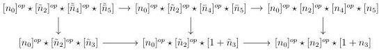
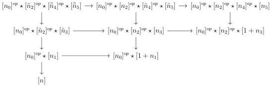
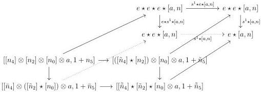
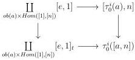

3.3. QUILLEN ADJUNCTION WITH tPsh(Δ)

This induces cartesian squares

The outer squares fits in the following cartesian squares:

This induces a diagram:

where we know that everything except the behind square commutes. As this is true for any x, lemma 3.3.1.3 implies the desired commutativity.

Definition 3.3.1.6. For k ≤ 1, the intelligent k-truncation functor, noted by τ_k^i, is the colimit preserving functor such that τ_k^i([a, n]) = [τ_{k-1}^i(a), n] and τ_k^i[e, 1]_t = [e, 1]_t. The intelligent 0-truncation functor, denoted by τ_0^i, is the colimit preserving functor such that τ_0^i([a, n]) fits in the following pushout

141