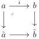
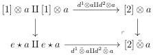

3.3. QUILLEN ADJUNCTION WITH tPsh(Δ)

### 3.3.2 Complicial horn inclusions

Notation. In this section, we will often consider morphisms $\tilde{a} \to \tilde{b}$ that fit into cocartesian squares:

where $a \to \tilde{a}$ and $b \to \tilde{b}$ are epimorphisms. To avoid complicating the notations unnecessarily, the induced morphism $\tilde{a} \to \tilde{b}$ will just be denoted $i$.

3.3.2.1. A marked Segal A-precategory is a stratified Segal A-precategory having the right lifting property against all entire acyclic cofibrations. We denote by mSeg(A) the full subcategory of marked Segal A-precategory. We then have an adjunction:

$$(\_)_{\mathrm{mk}} : \mathrm{tSeg}(A) \xleftarrow{\perp} \mathrm{mSeg}(A) : \iota$$

where the left adjoint $(\_)_{\mathrm{mk}}$ sends a stratified Segal A-precategory $(C, tC)$ to the marked Segal A-precategory $(C, \overline{tC})$, where $\overline{tC}$ is the smaller stratification that includes $tC$ and makes $(C, \overline{tC})$ a marked Segal A-precategory, and where the right adjoint is a fully faithful inclusion. Remark furthermore that at the level of preshaves, these two adjoints are the identity. We denote $r_C : C \to C_{\mathrm{mk}}$ the canonical inclusion. The proposition 2.1.2.9 states that $r_C$ is an entire acyclic cofibration.

There is an isomorphism $(e \star C_{\mathrm{mk}})_{\mathrm{mk}} \cong (e \star C)_{\mathrm{mk}}$. Indeed $e \star \_$ preserves both entire cofibrations and weak equivalences, we have two entire acyclic cofibration $e \star C \to (e \star C)_{\mathrm{mk}}$ and $e \star C \to (e \star C_{\mathrm{mk}})_{\mathrm{mk}}$. As the two codomain are marked, they are isomorphic.

The fact that will be used the most with the marked Segal A-precategory is their right lifting property with respect to morphisms of shape $[\tau_n^i(a), \Lambda^1[2]] \cup [a, 2] \to [\tau_n^i(a), 2]$. This fact will be used freely.

3.3.2.2. We recall that $[2] \bar{\otimes} a$ is the following pushout:

We define $[e, 1] \vee (e \star [a, 1])$ as the colimit of the following diagram

$$[e, 1] \vee [e \star a, 1] \xleftarrow{[d^0 \star a, 2]} [e, 1] \vee [a, 1] \xrightarrow{[a, d^2]} [e, 2] \vee [a, 1]$$

143