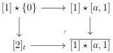

CHAPTER 3. COMPLICIAL SETS AS A MODEL OF \((\infty, \omega)\)-CATEGORIES

The canonical composite morphism

\[
[ e \star a, 1 ] \xrightarrow {[ e \star a , d ^ {1} ]} [ e, 1 ] \vee [ e \star a, 1 ] \to [ e, 1 ] \vee (e \star [ a, 1 ])
\]

is also denoted by \([e\star a,d^1]\). Eventually, we define \(\overline{[1]\star[a,1]}\) as the following pushout

Lemma 3.3.2.3. There is a weak equivalence from \(\overline{[1] \star [a, 1]}\) to the colimit of the diagram

\[
[ [ 1 ] \star a, 1 ] \xleftarrow {[ d ^ {0} \star a , 1 ]} [ e \star a, 1 ] \xrightarrow {[ e \star a , d ^ {1} ]} [ e, 1 ] \vee (e \star [ a, 1 ])
\]

making \(\overline{[1] \star [a, 1]}\) the homotopy colimit of the previous diagram.

Proof. The proposition 3.2.2.8 implies that \((\overline{[1] \star [a, 1]})_{\mathrm{mk}}\) is the colimit of the diagram

\[
\begin{array}{c} \left[ [ 2 ] ^ {2} \bar {\otimes} a, 1 \right] \xleftarrow {[ d ^ {0} \otimes a , 1 ]} \left[ [ 1 ] _ {t} \otimes a, 1 \right] \xrightarrow {[ [ 1 ] \otimes a , d ^ {1} ]} \left[ [ 1 ] _ {t}, 1 \right] \vee [ a, 1 ] \xleftarrow {[ d ^ {0} \otimes a , 2 ]} [ e, 1 ] \vee [ a, 1 ] \xrightarrow {[ a , d ^ {1} ]} [ e, 2 ] \vee [ a, 1 ] \\ \left[ d ^ {1} \bar {\otimes} a, 1 \right] \uparrow \\ [ e \star a, 1 ] \xleftarrow {[ d ^ {0} \star a , 1 ]} [ a, 1 ] \xrightarrow {[ a , d ^ {1} ]} [ e, 1 ] \vee [ a, 1 ] \\ \left[ d ^ {1} \star a, 1 \right] \downarrow \\ [ [ 1 ] \star a, 1 ] \xleftarrow {[ d ^ {0} \star a , 1 ]} [ d ^ {0} \star a, 1 ] \downarrow \\ [ e \star a, 1 ] \xrightarrow {[ e \star a , d ^ {1} ]} [ e, 1 ] \vee [ e \star a, 1 ] \end{array} \tag {3.3.2.4}
\]

In the previous diagram, the fact that we have \(\left[[1]_t\otimes a,1\right]\) instead of \(\left[[1]\otimes a,1\right]\) comes from the fact that we have considered \((\overline{[1]\star[a,1]})_{\mathrm{mk}}\) instead of \(\overline{[1]\star[a,1]}\).

Consider now the morphism

\[
[ [ 2 ] ^ {2} \bar {\otimes} a, 1 ] \coprod_ {[ [ 1 ] _ {t} \otimes a, 1 ]} [ [ 1 ] _ {t}, 1 ] \vee [ a, 1 ] \rightarrow e \star [ a, 1 ] \tag {3.3.2.5}
\]

induces by the vertical colimit of the diagram

\[
\begin{array}{c} \left[ [ 2 ] ^ {2} \bar {\otimes} a, 1 \right] \xleftarrow {[ d ^ {0} \otimes a , 1 ]} \left[ [ 1 ] _ {t} \otimes a, 1 \right] \xrightarrow {[ [ 1 ] \otimes a , d ^ {1} ]} \left[ [ 1 ] _ {t}, 1 \right] \vee [ a, 1 ] \\ \left[ s ^ {0} \bar {\otimes} a, 1 \right] \Biggl \downarrow \quad \quad \quad \quad \quad \quad \quad \quad \quad \quad \quad \quad \quad \quad \quad \quad \quad \quad \quad \quad \quad \quad \quad \quad \quad \quad \quad \quad \quad \quad \quad \quad \quad \quad \quad \quad \quad \quad \quad \quad \quad \quad \quad \quad \quad \quad \quad \quad \quad \quad \text {   } \\ [ e \star a, 1 ] \xleftarrow {} [ a, 1 ] \xrightarrow {} [ e, 1 ] \vee [ a, 1 ] \end{array} \tag {3.3.2.6}
\]

As all the vertical morphisms of  \( (3.3.2.6) \)  are cofibrations, the colimit of each line is a homotopy colimit. As all the horizontal morphisms of  \( (3.3.2.6) \)  are weak equivalences, the morphism  \( (3.3.2.5) \)  also is a weak equivalence.

144