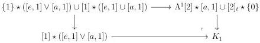
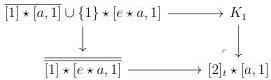
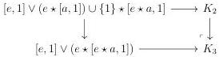
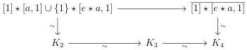

CHAPTER 3. COMPLICIAL SETS AS A MODEL OF \((\infty, \omega)\)-CATEGORIES

Let \( K_{1} \) be the following pushout:

The left-hand morphism is equal to \((d^0:[0]\to [1])\hat{\star} ([e,1]\cup [a,1]\to [e,1]\lor [a,1])\) which is an acyclic cofibration according to lemma 3.3.1.9. Furthermore, the morphism \(K_{1}\rightarrow\) \([2]_t\star [a,1]\) fits in the following pushout:

The lemma 3.3.2.3 implies that we have a weak equivalence from \(\overline{[1] \star [a, 1]} \cup \{1\} \star [e \star a, 1]\) to the colimit, denoted by \(K_2\), of the diagram

\[
[ [ 1 ] \star a, 1 ] \xleftarrow {[ d ^ {0} \star a , 1 ]} [ e \star a, 1 ] \xrightarrow {[ e \star a , d ^ {1} ]} [ e, 1 ] \vee (e \star [ a, 1 ]) \cup \{1 \} \star [ e \star a, 1 ]
\]

As all the morphisms are cofibrations, \( K_{2} \) is also the homotopy colimit of the previous diagram. We now define \( K_{3} \) as the colimit of the diagram

\[
[ \Lambda^ {1} [ 2 ] \star a, 1 ] \xleftarrow {[ d ^ {0} \star a , 1 ]} [ [ 1 ] \star a, 1 ] \xrightarrow {[ [ 1 ] \star a , d ^ {1} ]} [ e, 1 ] \vee (e \star [ e \star a, 1 ])
\]

The canonical morphism \( K_{2} \to K_{3} \) fits in the cocartesian square

and is then a weak equivalence according to the lemma 3.3.2.8.

On the other side, the lemma 3.3.2.3 also implies that we have a weak equivalence from \(\overline{[1] \star [e \star a, 1]}\) to the colimit, denoted by \(K_4\), of the diagram

\[
[ [ 2 ] _ {t} \star a, 1 ] \xleftarrow {[ d ^ {0} \star a , 1 ]} [ [ 1 ] \star a, 1 ] \xrightarrow {[ [ 1 ] \star a , d ^ {1} ]} [ e, 1 ] \vee (e \star [ e \star a, 1 ])
\]

As all the morphisms are cofibrations, \( K_{4} \) is also the homotopy colimit of the previous diagram. As \( \Lambda^1 [2]\star a\to [2]_t\star a \) is a weak equivalence in \( A \), this implies that the canonical morphism \( K_{3}\rightarrow K_{4} \) is also a weak equivalence. We then have commutative diagram:

148