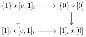
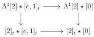

3.3. QUILLEN ADJUNCTION WITH tPsh(Δ)

where all arrows labelled by ∼ are weak equivalences. By two out of three, this implies the result.

Lemma 3.3.2.14. For any stratified Segal A-precategory C, the morphisms Λ¹[2] ⋆ C → [2]ₜ ⋆ C and {1} ⋆ C → [1]ₜ ⋆ C are acyclic cofibrations. Moreover, for any cofibration of stratified Segal A-precategory i, and j being either {1} → [1]ₜ or Λ¹[2] → [2]ₜ, the morphism j ⋆ i is an acyclic cofibration.

Proof. We begin with the first assertion. The lemma 3.3.1.9 implies that Λ¹[2] ⋆ _ and [2]ₜ ⋆ _ are left Quillen functors. As every object is a homotopy colimits of objects of shape [a, n] or [e, 1]ₜ, we can reduce to the case where C is of this shape. Using Segal extensions, we can reduce to the case where C is [a, 1], [0] or [e, 1]ₜ.

If C is [a, 1] or [0], the result follows from lemmas 3.3.2.10, 3.3.2.11, 3.3.2.12 and 3.3.2.13.

Eventually, for C := [e, 1]ₜ, we have a diagram:

Lemmas 3.3.1.9, 3.3.2.10 and 3.3.2.12 imply that all horizontal morphisms and right vertical morphisms are weak equivalences. By two out of three, this implies that the left vertical morphisms are weak equivalences.

This concludes the proof of the first assertion. The second one is obtained with some diagram chasing.

Proposition 3.3.2.15. The functor tPsh(Δ) → tSeg(A) sends complicial horn inclusions to weak equivalences.

Proof. Let k ≤ n be two integers. First, we suppose that 0 < k < n. We then have an equality

$$(\Lambda^k[n] \to [n]^k) = (\partial[k-2] \to [k-2]) \hat{\star}(\Lambda^1[2] \to [2]_t) \hat{\star}(\partial[n-k-2] \to [n-k-2]).$$

This is an acyclic cofibration according to lemmas 3.3.1.9 and 3.3.2.14. If k = 0, we have an equality

$$(\Lambda^0[n] \to [n]^0) = (\{1\} \to [e, 1]_t) \hat{\star}(\partial[n-2] \to [n-2])$$

and the right hand morphism is an acyclic cofibration again thanks to lemma 3.3.2.14. Eventually, for k = n, note that

$$(\Lambda^n[n] \to [n]^n) = (\partial[n-2] \to [n-2]) \hat{\star}(\{0\} \to [e, 1]_t).$$

This morphism is an acyclic cofibration according to lemma 3.3.1.9.

149