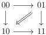
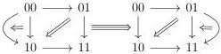

Introduction

and by $\mathbf{D}_2$ the 2-category generated by the 2-graph

The Gray tensor product of $\mathbf{D}_1$ with itself, denoted by $\mathbf{D}_1 \otimes \mathbf{D}_1$, is the 2-category generated by the diagram

The Gray tensor product of $\mathbf{D}_2$ with $\mathbf{D}_1$, denoted by $\mathbf{D}_2 \otimes \mathbf{D}_1$, is the 3-category generated by the diagram

As we can see from these examples, the Gray tensor product adds the dimension of the inputs (in contrast to the cartesian product, which takes the maximum). Thus, $(\infty, n)$-categories are not stable under this operation. One can handle this by considering a truncated version of the Gray tensor product, but we believe that avoiding such violent operation will lead to a more natural understanding of the complex combinatorics it encodes.

One way to avoid all these issues related to the increasing of dimension is to directly focus on $(\infty, \omega)$-categories, which will be the standpoint of this thesis.

## A brief definition of $(\gamma, n)$-categories for $n \in \mathbb{N} \cup \{\omega\}$

A *globular set* is the data of a diagram of sets

$$X_0 \xleftarrow{\pi_0^+} X_1 \xleftarrow{\pi_1^+} X_2 \xleftarrow{\pi_2^+} \dots$$

with the relations $\pi_{n-1}^\epsilon \pi_n^+ = \pi_n^\epsilon \pi_n^-$ for any $n > 0$ and $\epsilon \in \{+, -\}$. We also denote by $\pi_k^\epsilon$ the map $X_n \to X_k$ for $k < n$ obtained by composing any string of arrows starting with $\pi_k^\epsilon$. An $\omega$-*category* is a globular set $X$ together with

(1) operations of *compositions*

$$X_n \times_{X_k} X_n \to X_n \quad (0 \le k < n)$$

which associate to two $n$-cells $(x, y)$ verifying $\pi_k^+(x) = \pi_k^-(y)$, an $n$-cell $x \circ_k y$,

6