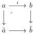
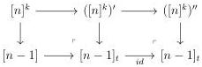
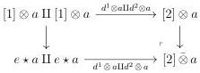
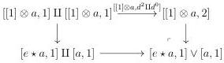

CHAPTER 3. COMPLICIAL SETS AS A MODEL OF \((\infty, \omega)\)-CATEGORIES

#### 3.3.3 Complicial thinness extensions

Notation. In this section, we will often consider morphisms \(\tilde{a} \to \tilde{b}\) that fit into cocartesian squares:

where  \( a \rightarrow \tilde{a} \)  and  \( b \rightarrow \tilde{b} \)  are epimorphisms. To avoid complicating the notations unnecessarily, the induced morphism  \( \tilde{a} \rightarrow \tilde{b} \)  will just be denoted i.

Lemma 3.3.3.1. Morphisms \(([n]^0)' \to ([n]^0)''\) and \(([n]^n)' \to ([n]^n)''\) are acyclic cofibrations.

Proof. For \( k \) equal to 0 or \( n \), we have pushout diagrams:

Lemmas 3.3.1.9 and 3.3.2.14 imply that both \( s^0 : [n]^0 \to [n-1] \) and \( s^{n-1} : [n]^{n-1} \to [n-1] \) are weak equivalences. As horizontal morphisms are cofibrations, the left properness imply that all the vertical morphisms are weak equivalences. By two out of three, this shows that \( ([n]^k)' \to ([n]^k)'' \) is a weak equivalence.

Construction 3.3.3.2. We consider these objects of \(\Delta_{\mathbb{Z}[1]}^2\) and \(\Delta_{\mathbb{Z}[2]}^2\):

\[
\begin{array}{l} s ^ {1}: [ 1 ] ^ {o p} \star [ 0 ] \rightarrow [ 1 ] \quad s ^ {0}: [ 0 ] ^ {o p} \star [ 1 ] \rightarrow [ 1 ] \\ s ^ {1}: [ 1 ] ^ {o p} \star [ 1 ] \rightarrow [ 2 ] s ^ {2}: [ 2 ] ^ {o p} \star [ 0 ] \rightarrow [ 2 ]. \\ \end{array}
\]

They induce morphisms:

\[
\begin{array}{l} \alpha_ {a}: [ e \star a, 1 ] \rightarrow e \star [ a, 1 ] \quad \beta_ {a}: [ e, 1 ] \vee [ a, 1 ] \rightarrow e \star [ a, 1 ] \\ \delta_ {a}: [ e \star a, 1 ] \vee [ a, 1 ] \rightarrow e \star ([ a, 2 ]) \quad \epsilon_ {a}: [ [ 2 ] \bar {\otimes} a, 1 ] \rightarrow e \star ([ a, 2 ]) \\ \end{array}
\]

where \([2] \bar{\otimes} a\) and \([e \star a, 1] \vee [a, 1]\) are the following pushouts:

150