3.3. QUILLEN ADJUNCTION WITH tPsh(Δ)

Moreover there are commutative diagrams:

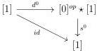

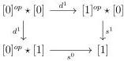

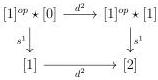

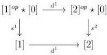

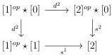

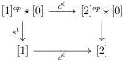

which induce commutative diagrams:

(1):

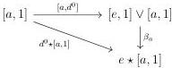

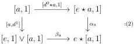

(3):

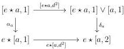

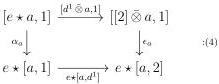

(5):

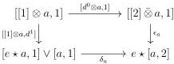

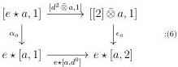

Definition 3.3.3.3. Let \( b \) be an object of \( A \) and \( x: a \to b \), \( x': a' \to b \) two morphisms. The element \( b \) is \( n \)-relying on \( x \) if for any \( k \geq -1 \), the following square is homotopy cocartesian:

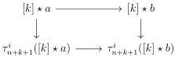

151