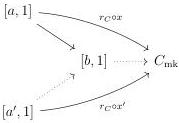
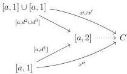
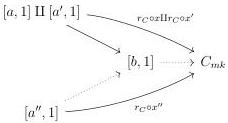

3.3. QUILLEN ADJUNCTION WITH tPsh(Δ)

the following diagram:

Definition 3.3.3.6. We also set $$(\bar{x} : [\bar{a}, 1] \to C, \bar{x}' : [\bar{a}', 1] \to C) \geq_n \bar{x}'' : [\bar{a}'', 1] \to C$$ if there exists three elements $$x : [a, 1] \to C$$, $$x' : [a', 1] \to C$$ and $$x'' : [a'', 1] \to C$$ such that $$\bar{x} \geq_n x$$, $$\bar{x}' \geq_n x'$$, $$x'' \geq_n \bar{x}''$$ and one of the two following conditions is verified:

(1) The elements $$a$$, $$a'$$ and $$a''$$ are equal and there exists a dotted arrow:

(2) There exists an element $$b$$ which is $$(n - 1)$$-relying on $$a \to b$$ and $$a' \to b$$ and dotted arrows in the following diagram:

Proposition 3.3.3.7. Let $$C$$ be a stratified Segal $$A$$-precategory and $$x : [a, 1] \to C$$, $$y : [a', 1] \to C$$ two morphisms such that $$x \geq_n y$$. The morphism

$$C \coprod_{[a,1]} \tau_n^i([a, 1]) \to \tau_n^i([a', 1]) \coprod_{[a',1]} C \coprod_{[a,1]} \tau_n^i([a, 1])$$

is an acyclic cofibration.

153