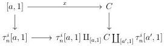
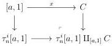
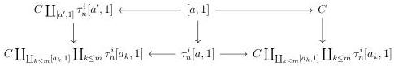

CHAPTER 3. COMPLICIAL SETS AS A MODEL OF \((\infty, \omega)\)-CATEGORIES

Proof. By two out of three, we can suppose without loss of generality that C is already a marked Segal A-precategory. We suppose first that x and y fulfill one of the three cases of definition 3.3.3.5. The following square is then homotopy cartesian:

As the cocartesian square:

is also homotopy cocartesian, this implies that

\[
C \coprod_ {[ a, 1 ]} \tau_ {n} ^ {i} ([ a, 1 ]) \rightarrow \tau_ {n} ^ {i} ([ a ^ {\prime}, 1 ]) \coprod_ {[ a ^ {\prime}, 1 ]} C \coprod_ {[ a, 1 ]} \tau_ {n} ^ {i} ([ a, 1 ])
\]

is an acyclic cofibration. Suppose now that there exists a family of morphisms  \( (x_{k} : [a_{k}, 1])_{k \leq m} \to C \)  such that  \( x_{0} = x \) ,  \( x_{m} = y \)  and for any k,  \( x_{k} \)  and  \( x_{k+1} \)  fulfill one of the three cases of definition 3.3.3.5. We then have two homotopy cocartesian squares:

As before, this implies that

\[
C \coprod_ {[ a, 1 ]} \tau_ {n} ^ {i} ([ a, 1 ]) \to C \coprod_ {\coprod_ {k \leq m} [ a _ {k}, 1 ]} \coprod_ {k \leq m} \tau_ {n} ^ {i} [ a _ {k}, 1 ]
\]

and

\[
\tau_ {n} ^ {i} ([ a ^ {\prime}, 1 ]) \coprod_ {[ a ^ {\prime}, 1 ]} C \coprod_ {[ a, 1 ]} \tau_ {n} ^ {i} ([ a, 1 ]) \to C \coprod_ {\coprod_ {k \leq m} [ a _ {k}, 1 ]} \coprod_ {k \leq m} \tau_ {n} ^ {i} [ a _ {k}, 1 ]
\]

are acyclic cofibrations. By two out of three, this implies the result.

One can show similarly:

Proposition 3.3.3.8. Let C be a stratified Segal A-precategory, and  \( x : [a,1] \to C \) ,  \( y : [a',1] \to C \)  and  \( z : [a'',1] \to C \)  three morphisms such that  \( (x,y) \geq_{n} z \) . The morphism

\[
\tau_ {n} ^ {i} ([ a ^ {\prime}, 1 ]) \coprod_ {[ a ^ {\prime}, 1 ]} C \coprod_ {[ a, 1 ]} \tau_ {n} ^ {i} ([ a, 1 ]) \to \tau_ {n} ^ {i} ([ a ^ {\prime}, 1 ]) \coprod_ {[ a ^ {\prime}, 1 ]} C \coprod_ {[ a, 1 ]} \tau_ {n} ^ {i} ([ a, 1 ]) \coprod_ {[ a ^ {\prime \prime}, 1 ]} \tau_ {n} ^ {i} ([ a ^ {\prime \prime}, 1 ])
\]

is an acyclic cofibration.

154