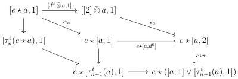
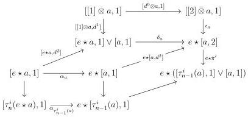
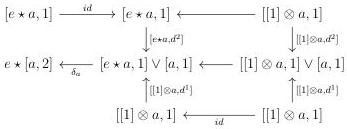

CHAPTER 3. COMPLICIAL SETS AS A MODEL OF \((\infty, \omega)\)-CATEGORIES

Proof. Using the diagram (6).3.3.3.2 we get a diagram

The morphism \(r_{e\star ([a,1]\vee [\tau_{n - 1}^i (a),1])}\circ e\star \pi \circ \epsilon_a\) then factors through \([ [2]\bar{\otimes} a\coprod_{d^2\otimes a}\tau_n^i (e\star a),1]\). According to lemma 3.3.3.10, we then get the first inequalities.

For the second inequality, using the diagrams (3).3.3.3.2 and (5).3.3.3.2, we have a diagram:

This implies that \(r_{e\star ([\tau_{n - 1}^i (a),1]\vee [a,1])}\circ e\star \pi '\circ e\star [a,d^2 ]\circ \alpha_a\) factors through \([\tau_n^i (e\star a),1]\). The morphism \(r_{e\star ([\tau_{n - 1}^i (a),1]\vee [a,1])}\circ e\star \pi \circ \epsilon_a\) then factors through \([ [2]\otimes a\coprod_{d^0\otimes a}\tau_n^i ([1]\otimes a),1]\). According to lemma 3.3.3.10, we then get the second inequality.

Lemma 3.3.3.12. Let \( n \) be an integer strictly superior to 1 and \( a \) such that \( \tau_n^i (a) = a \). We then have \( \delta_a\circ [e\star a,d^2 ]\geq_{n + 1}\delta_a\circ [[1]\otimes a,d^1 ] \).

Proof. There is a diagram:

156