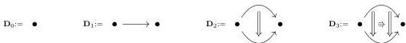
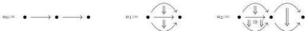
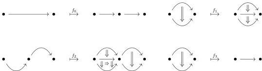

(2) as well as *units*

$$X_n \rightarrow X_{n+1}$$

which associate to an $n$-cell $x$, an $(n+1)$-cell $\mathbb{I}_x$,

and satisfying some associativity and unitaly axioms which will be expected by any reader familiar with 2-categories (see 1.1.1.2 for the precise formulation of these axioms). A *morphism of $\omega$-categories* is a map of globular sets commuting with both operations. The category of $\omega$-categories is denoted by $\omega$-cat.

The category $\Theta$ of Joyal is the full subcategory of $\omega$-cat spanned by the *globular sums*. These objects are precisely defined in paragraph 1.1.2.2. Roughly speaking, globular sums are the $\omega$-categories obtained by "directed" gluing of *globes*. In particular, globes are the easiest example of globular sums. Here are a few examples of globes and globular sums, where we identify the pasting diagrams with the $\omega$-categories they generate.

**Example** (some examples of globes).

**Example** (some examples of globular sums).

**Example** (some examples of morphisms between globular sums).

For $n \in \mathbb{N} \cup \{\omega\}$, we define $\Theta_n$ as the full subcategory of $\Theta$ whose objects correspond to $n$-categories. In particular, $\Theta_0$ is the terminal category, $\Theta_1$ is $\Delta$, and $\Theta_\omega$ is $\Theta$.

Let $\gamma$ be a complete $(\infty, 1)$-category and $n \in \mathbb{N} \cup \{\omega\}$. A $(\gamma, n)$-category is a functor $\Theta_n^{op} \rightarrow \gamma$ that satisfies the *Segal conditions* and *completeness conditions*. We denote

7