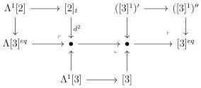
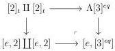
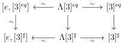

3.3. QUILLEN ADJUNCTION WITH tPsh(Δ)

The morphism \(([n]^k)' \to ([n]^k)''\) is then a weak equivalence.

#### 3.3.4 Saturation extensions

Let \(\Lambda[3]^{eq} \to [3]^{eq}\) be the entire inclusion generated by \(Im(d^3) \cup Im(d^0) \subset [3]\). This inclusion fits in the following sequence:

This inclusion is then a weak equivalence according to propositions 3.3.2.15 and 3.3.3.20. Now, note that we have a pushout:

As the left vertical morphism is a weak equivalence, so is the right one. Let \(\Lambda[3]^{\sharp} \to [3]^{\sharp}\) be the entire inclusion generated by \(Im(d^3) \cup Im(d^0) \subset [3]\). Using the same reasoning, we show that this cofibration is acyclic and that there is a weak equivalence \(\Lambda[3]^{\sharp} \to [e, [3]^{\sharp}]\). We then have a commutative square:

where all arrows labelled by  \( \sim \)  are weak equivalences. By two out of three, this implies that  \( [3]^{eq} \rightarrow [3]^{\sharp} \)  is a weak equivalence. Combined with the lemma 3.3.1.9, this implies the following proposition:

Proposition 3.3.4.1. For any \( n \geq -1 \), the morphism \( [n] \star [3]^{eq} \to [n] \star [3]^{\sharp} \) is an acyclic cofibration.

Theorem 3.3.4.2. The stratified cosimplicial object constructed in paragraph 3.3.1.7 induces a Quillen adjunction \(\mathrm{tPsh}(\Delta)^{\omega}\to \mathrm{tSeg}(A)\).

Proof. It is a direct consequence of theorem 2.2.1.6 and propositions 3.3.2.15, 3.3.3.20, and 3.3.4.1. \(\square\)

161