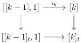
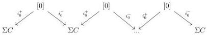

CHAPTER 3. COMPLICIAL SETS AS A MODEL OF \((\infty, \omega)\)-CATEGORIES

### 3.4 The case  \( A := \operatorname{tPsh}(\Delta)^{n} \)

For \( n \in \mathbb{N} \cup \{\omega\} \), we denote by \( \mathrm{tPsh}(\Delta)^n \) the category of stratified simplicial set endowed with the model structure for \( n \)-complicial set given in theorem 2.2.1.6. As remarked in example 3.1.3.5, these model categories are Gray modules. The functor \( \mathrm{tPsh}(\Delta) \to \mathrm{tSeg}(\mathrm{tPsh}(\Delta)^n) \) defined in 3.3.1.7 is left Quillen according to theorem 3.3.4.2. It was noted in paragraph 3.3.3.16 that for \( k > 0 \), \( [k] \to [k]_t \) fits in the following cocartesian square:

The functor \(\mathrm{tPsh}(\Delta) \to \mathrm{tSeg}(\mathrm{tPsh}(\Delta)^n)\) then sends \([k] \to [k]_t\) to an acyclic cofibration for \(k > n + 1\), and then induces a left Quillen functor

\[
i ^ {n + 1}: \mathrm{tPsh} (\Delta) ^ {n + 1} \rightarrow \mathrm{tSeg} (\mathrm{tPsh} (\Delta) ^ {n}) \tag {3.4.0.1}
\]

#### 3.4.1 Comparison with \((0,\omega)\)-cat

We denote by

\[
\mathrm{R}: \mathrm{tPsh} (\Delta) ^ {\omega} \xrightarrow [ \leftarrow ]{\perp} (0, \omega) \text {-cat}: \mathrm{N}
\]

the adjunction between stratified simplicial sets and  \( (0,\omega) \) -categories described in section 2.2.4. For an  \( (0,\omega) \) -category C and an integer n, the  \( (0,\omega) \) -category  \( [C,n] \)  is defined as the colimit of the following diagram

This induces an adjunction

\[
\mathrm{R}: \mathrm{tSeg} (\mathrm{tPsh} (\Delta)) \xrightarrow [ \leftarrow ]{\perp} (0, \omega) \text {-cat}: \mathrm{N}
\]

where the left adjoint sends  \( [K,n] \)  to  \( [\mathrm{R}(K),n] \)  and  \( [e,1]_{t} \)  on [0].

Lemma 3.4.1.1. For any \((0,\omega)\)-category \(C\), the canonical morphism

\[
[ \mathrm{N} C, 1 ] \rightarrow \mathrm{N} [ C, 1 ]
\]

is an isomorphism.

162