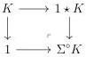

3.4. THE CASE $A := \mathrm{tPsh}(\Delta)^n$

subcategory of $\Delta$ whose morphisms are the monomorphisms. The lemma 2.4.4.12 then implies that $\phi : (\mathrm{R} i^\omega)_{|\Delta} \to \mathrm{R}_{|\Delta}$ is natural. As all these functors commute with the intelligent truncations, we can extend it to a natural transformation $\phi : (\mathrm{R} i^\omega)_{|t\Delta} \to \mathrm{R}_{|t\Delta}$. Eventually, as all theses morphisms preserves colimits, we can extend $\phi$ to an invertible natural transformation $\phi : \mathrm{R} i^\omega \to \mathrm{R}$.

We now turn our attention to the second assertion. We define the functor $\Sigma^\circ : \mathrm{tPsh}(\Delta) \to \mathrm{tPsh}(\Delta)$ that sends a stratified simplicial set $K$ onto the following pushout:

Remark that we have a canonical equivalence

$$(\Sigma^\circ X)^{op} \sim \Sigma^* X^{op}$$

where $\Sigma^*$ is the functor defined in paragraph 2.2.2.16. As the nerve commutes with the op-dualities, and as globes are invariant under it, a repeated application of [OR22, theorem 3.22] imply that the following canonical morphism between stratified simplicial sets

$$(\Sigma^\circ)^k[0] \to \mathrm{N}(\mathbf{D}_k)$$

is an acyclic cofibration. Furthermore, proposition 3.2.3.4 provides a weak equivalence

$$i^{n+1}(\Sigma^\circ K) \to \Sigma^\circ K.$$

A direct induction then induces a weak equivalence

$$i^{n+1}((\Sigma^\circ)^k[0]) \to (\Sigma^\circ)^k[0]$$

Otherwise, remark that by construction, $\Sigma^\circ[K, 1] := [[0] \diamond K \coprod_K[0], 1]$. The weak equivalence $[0] \diamond K \to [0] \star K$ provided by proposition 2.2.2.15 induces a weak equivalence

$$\Sigma^\circ[K, 1] \to [\Sigma^\circ K, 1].$$

As $\Sigma^\circ[0] = [[0], 1]$, a direct induction induces a weak equivalence

$$(\Sigma^\circ)^k[0] \to [(\Sigma^\circ)^{k-1}([0]), 1].$$

All put together, and using lemma 3.4.1.1, this induces two acyclic cofibrations

$$\begin{array}{l} \psi_k : \ i^{n+1}((\Sigma^\circ)^k[0]) \xrightarrow{\sim} \mathrm{N} \mathbf{D}_k \\ \psi'_k : \ i^{n+1}((\Sigma^\circ)^k[0]) \xrightarrow{\sim} (\Sigma^\circ)^k[0] \xrightarrow{\sim} [(\Sigma^\circ)^{k-1}[0], 1] \xrightarrow{\sim} [\mathrm{N} \mathbf{D}_{k-1}, 1] \cong \mathrm{N} \mathbf{D}_k \end{array}$$

165