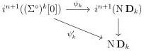
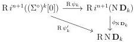
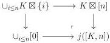

CHAPTER 3. COMPLICIAL SETS AS A MODEL OF \((\infty, \omega)\)-CATEGORIES

To concludes, one have to show that the induces diagram

commutes. By adjunction, this is sufficient to show that the diagram

commutes. We claim that  \( R N D_{k} \)  has no non-trivial automorphisms. This directly implies the results as R sends acyclic cofibrations to isomorphisms.

It then remains to show that  \( RN D_{k} \)  has no non-trivial automorphisms. If k = 0, this is trivial as  \( RN D_{0} \cong D_{0} \) . We suppose now that k > 0. As R commutes with the suspension and sends acyclic cofibration to isomorphism, the lemma 3.4.1.1 and a repeated application of the theorem 2.2.4.2 imply that the morphism

\[
\begin{array}{l} \mathbf {D} _ {k} = [ \mathbf {D} _ {k - 1}, 1 ] \\ \cong [ \Sigma^ {k - 1} \mathrm{RND} _ {0}, 1 ] \\ \cong \mathrm{R} [ \Sigma^ {k - 1} \mathrm{ND} _ {0}, 1 ] \\ \rightarrow \mathrm{R} [ \mathrm{N} \Sigma^ {k - 1} \mathbf {D} _ {0}, 1 ] \\ \cong \mathrm{RN} [ \Sigma^ {k - 1} \mathbf {D} _ {0}, 1 ] \\ = \mathrm{RND} _ {k} \\ \end{array}
\]

is an isomorphism. The result then follows from proposition 1.2.3.11 that states that \(\mathbf{D}_k\) has no non-trivial automorphisms.

#### 3.4.2 The other adjunction

We define the colimit preserving functor

\[
j: \mathrm{tSeg} (\mathrm{tPsh} (\Delta)) \rightarrow \mathrm{tPsh} (\Delta) \tag {3.4.2.1}
\]

sending \([K,n]\) to the pushout:

166