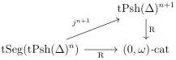

3.4. THE CASE \(A := \mathrm{tPsh}(\Delta)^n\)

and $[[0], 1]_t$ to $[1]_t$. As $_\boxtimes_-$ is a left Quillen bifunctor, and as $j([[0], 1]_t \to [0]) = [1]_t \to [0]$ and $j([[0], E^{\cong}] \to [[0], (E^{\cong})']) = E^{\cong} \to (E^{\cong})'$ are weak equivalences, the proposition 3.1.2.10 implies that the functor

$$
j^\omega : \mathrm{tSeg}(\mathrm{tPsh}(\Delta)^\omega) \to \mathrm{tPsh}(\Delta)^\omega
$$

is a left Quillen functor. By definition of the Gray pre-tensor given in [Ver08c, Definition 128], we remark that $j([[k], n] \to [[k]_t, n])$ is a pushout of a disjoint union of $[k + 1] \to [k + 1]_t$. This implies that for any $n \in \mathbb{N}$,

$$
j^{n+1} : \mathrm{tSeg}(\mathrm{tPsh}(\Delta)^n) \to \mathrm{tPsh}(\Delta)^{n+1}
$$

is a left Quillen functor.

**Proposition 3.4.2.2.** *The following triangle commutes up to an invertible natural transformation:*

*For any integer $k \leq n + 1$, the induced morphism $j^{n+1}(\mathrm{N}\mathbf{D}_k) \to \mathrm{N}(\mathbf{D}_k)$ is a weak equivalence.*

*Proof.* The first assertion is a direct consequence of the definition of $\mathrm{R} : \mathrm{tSeg}(\mathrm{tPsh}(\Delta)^n) \to (0, \omega)$-cat and the corollary 1.2.3.19. We denote $\phi : \mathrm{R}j^{n+1} \to \mathrm{R}$ the corresponding invertible natural transformation.

For the second assertion, remark that the case $k = 0$ is trivial, and for $k > 0$, lemma 3.4.1.1, theorem 2.2.4.2 and the definition of $j^{n+1}$ induce a weak equivalence

$$
\psi_k : j^{n+1}(\mathrm{N}\mathbf{D}_k) \cong j^{n+1}([\mathrm{N}\mathbf{D}_{k-1}, 1]) = \Sigma \mathrm{N}\mathbf{D}_{k-1} \to \mathrm{N}[\mathbf{D}_{k-1}, 1] = \mathrm{N}\mathbf{D}_k
$$

To conclude, one have to show that $\phi_{\mathrm{N}\mathbf{D}_k}$ is equal to $\mathrm{R}\psi_k$. We claim that $\mathrm{R}\mathrm{N}\mathbf{D}_k$ has no non-trivial automorphisms. This directly implies the results as $\mathrm{R}$ sends acyclic cofibrations to isomorphisms.

It then remains to show that $\mathrm{R}\mathrm{N}\mathbf{D}_k$ has no non-trivial automorphisms. As $\mathrm{R}$ commutes with the suspension and sends acyclic cofibration to isomorphism, a repeated application of the theorem 2.2.4.2 implies that the morphism

$$
\mathbf{D}_k = \Sigma^k \mathbf{D}_0 \cong \Sigma^k \mathrm{R}\mathrm{N}\mathbf{D}_0 \cong \mathrm{R}\Sigma^k \mathrm{N}\mathbf{D}_0 \to \mathrm{R}\mathrm{N}\Sigma^k \mathbf{D}_0 \cong \mathrm{R}\mathrm{N}\mathbf{D}_k
$$

is an isomorphism. The result then follows from proposition 1.2.3.11 that states that $\mathbf{D}_k$ has no non-trivial automorphisms. $\square$

167