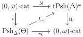
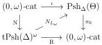

CHAPTER 3. COMPLICIAL SETS AS A MODEL OF \((\infty, \omega)\)-CATEGORIES

Proof. This is a direct consequence of the fact that  \( \mathrm{tPsh}(\Delta)^{n} \)  is the left Bousfield localization of  \( \mathrm{tPsh}(\Delta)^{\omega} \)  along morphisms  \( [m] \to [m]_{t} \)  for m > n. □

Lemma 3.4.3.13. The \((\infty,1)\)-functor \(L_{\omega}:(\mathrm{Psh}_{\Delta}(\Theta))^{(\infty,1)}\to (\mathrm{tPsh}(\Delta)^{\omega})^{(\infty,1)}\) is fully faithful.

Proof. We have to show that for any pair of \(\Theta\)-spaces \(X\) and \(Y\), the induced morphism of \(\infty\)-groupoids

\[
\mathrm{Hom} _ {(\mathrm{Psh} _ {\Delta} (\Theta)) ^ {(\infty , 1)}} (X, Y) \to \mathrm{Hom} _ {(\mathrm{tPsh} (\Delta) ^ {\omega}) ^ {(\infty , 1)}} (L _ {\omega} (X), L _ {\omega} (Y))
\]

is an equivalence. As every  \( \Theta \) -space is a  \( (\infty,1) \) -colimit of globular sums, which are themself  \( (\infty,1) \) -colimits of globes, we can suppose that X is of shape  \( D_{n} \) . In this case  \( D_{n} \)  is  \( \omega \) -small. As  \( L(\mathbf{D}_{n}) \)  has a finite presentation, given by the n-times interated suspension of [0], it is also  \( \omega \) -small.

Eventually, proposition 4.2.1.45 implies that every \(\Theta\)-spaces is a directed colimit of objects that are in the image of \(\iota_{n}\) for an integer \(n\). We can then restrict ourselves to the case where \(Y\) is in the image of \(\iota_{n}\). As we have an equivalences \(L_{\omega} \circ \iota_{n} \sim \tau_{n}^{i} \circ L_{n}\), the results follow from proposition 3.4.3.9, and lemmas 3.4.3.11 and 3.4.3.12.

Theorem 3.4.3.14. For any \(n \in \mathbb{N} \cup \{\omega\}\), the adjunction

\[
L _ {n}: \mathrm{Psh} _ {\Delta} (\Theta_ {n}) \xrightarrow [ \leftarrow ]{\perp} \mathrm{tPsh} (\Delta) ^ {\omega}: N _ {L _ {n}}
\]

is a Quillen equivalence. The two induced diagrams

commute up to homotopy.

Proof. If  \( n < \omega \) , the first assertion is a consequence of proposition 3.4.3.9. Suppose now that  \( n = \omega \) . The lemma 3.4.3.13 implies that the left adjoint is homotopically fully faithful. It then remains to show that the right adjoint is conservative. This is a direct consequence of the preservation of globes by  \( L_{\omega} \)  up to homotopy and theorem 2.4.2.9.

For the second assertion, it is sufficient to demonstrate that the restriction to  \( \Theta \)  of the canonical natural transformation  \( R \circ L_{\omega} \to \pi_{0} \)  is an isomorphism. As these two functors send Segal extensions on isomorphisms, it is sufficient to show the result on globes where it directly follows from the preservation of globes by  \( L_{\omega} \)  up to homotopy. ☐

170