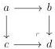
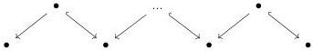

CHAPTER 4. THE \((\infty,1)\)-CATEGORY OF \((\infty,\omega)\)-CATEGORIES

4.1.1.3. If A is a 1-category, the adjunction (4.1.1.2) induces an adjunction:

\[
\pi_ {0}: \mathrm{Psh} ^ {\infty} (A) \xrightarrow [ \leftarrow ]{\perp} \mathrm{Psh} (A): \iota \tag {4.1.1.4}
\]

4.1.1.5. We recall that the notion of elegant Reedy category is defined in paragraph 1.1.2.5. The following lemma provides a powerful way to compute simple colimits in \((\infty, 1)\)-categories by reducing to computations in (stricts) categories. These techniques will be used freely in the rest of this text.

Lemma 4.1.1.6. Let \( A \) be a \( \mathbf{V} \)-small category. We denote \( \iota : \mathrm{Psh}(A) \to \mathrm{Psh}^{\infty}(A) \) the canonical inclusion.

(1) The functor \(\iota\) preserves cocartesian square

where the left vertical morphism is a monomorphism.

(2) The functor \(\iota\) preserves colimit of finite diagrams of shape:

where morphisms labeled  \( \hookrightarrow \)  are monomorphisms.

(3) The functor \(\iota\) preserves transfinite composition.
(4) For any \(\mathbf{V}\)-small elegant Reedy category, and any functor \(F: I \to \mathrm{Psh}(A)\) that is Reedy cofibrant, i.e such that for any \(i \in I\), \(\operatorname{colim}_{\partial i} F \to F(i)\) is a monomorphism, the canonical comparison

\[
\iota \operatorname{colim} F \to \operatorname{colim} \iota F
\]

is an isomorphism. In particular, if \( A \) is itself an elegant Reedy category, for any set-valued presheaf \( X \) on \( A \), there is an equivalence

\[
\iota (X) \sim \underset {A _ {/ X}} {\operatorname{colim}} a.
\]

Proof. For this result, we use model categories. We consider the interval induces by the constant functor  \( I: A \to \mathrm{Psh}(\Delta) \)  with value [1]. We then consider the model structure on  \( \mathrm{Psh}(A \times \Delta) \)  produced by [Cis06, theorem 1.3.22] and induces by the homotopical data  \( (I \times \_, \emptyset) \) . This model structure represents  \( \mathrm{Psh}^{\infty}(A) \) . To conclude, we then have to show that all the given colimits, seen as (simplicialy constant) presheaves on  \( \Delta \times A \)  are also homotopy colimits of the same diagrams. This then follows from proposition 2.1.1.3, 2.1.1.4, 2.1.1.5 and theorem 2.1.1.7. □

176