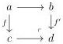
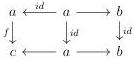
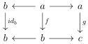

4.1. PRELIMINARIES

### 4.1.2 Factorization sytems

4.1.2.1. For the rest of the section, we fix a presentable $(\infty, 1)$-category $C$, i.e a $(\infty, 1)$-category $C$ that is a reflexive and $\mathbf{V}$-accessible localization of a $(\infty, 1)$-category of $\infty$-presheaves on a $\mathbf{V}$-small $(\infty, 1)$-category.

A full sub $\infty$-groupoid of the $\infty$-groupoid of arrows of $C$ is cocomplete if it is closed under colimit and composition and contains the equivalences. For a $\infty$-groupoid $S$, we define $\widehat{S}$ as the smallest cocomplete full sub $\infty$-groupoid of the $\infty$-groupoid of arrows containing $S$.

Remark 4.1.2.2. A cocomplete full sub $\infty$-groupoid $U$ is closed by pushouts along any morphism. Indeed, suppose given a cocartesian square

with $f$ in $U$. Remark that $f'$ is the horizontal colimit of the diagram

and then is in $U$.

We say that an $\infty$-groupoid of morphisms $T$ is closed under left cancellation (resp. closed under right cancellation), if for any pair of composable morphisms $f$ and $g$, if $gf$ and $f$ are in $T$, so is $g$ (resp. if $gf$ and $g$ are in $T$, so is $f$).

Proposition 4.1.2.3. Let $U$ be a cocomplete $\infty$-groupoid of arrows of $C$. The $\infty$-groupoid $U$ is closed under left cancellation.

Proof. Suppose given $f : a \to b$, $g : b \to c$ such that $gf$ and $f$ are in $S$. As $g$ is the horizontal colimit of the following diagram

it is in $U$.

177