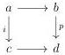
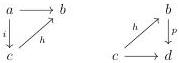
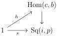

CHAPTER 4. THE \((\infty,1)\)-CATEGORY OF \((\infty,\omega)\)-CATEGORIES

4.1.2.4. We recall some standard results on factorization systems, which appear in many places in the literature, such as in section 5.5.5 of [Lur09a] for the \((\infty,1)\)-case and [Joy] for the strict case.

Let \( S \) be a \( \mathbf{V} \)-small \( \infty \)-groupoid of maps of \( C \). We denote by \( \operatorname{Arr}_S(C) \) the full sub \( (\infty, 1) \)-category of \( \operatorname{Arr}(C) \) whose objects correspond to arrows of \( S \).

A weak factorization system in  \( (L,R) \)  is the data of two full sub  \( \infty \) -groupoids L and R of the  \( \infty \) -groupoid of arrows of C, stable under composition and containing equivalences, and of section  \( \operatorname{Arr}_{R}(C)\to\operatorname{Arr}_{L}(C)\times_{C}\operatorname{Arr}_{R}(C) \)  of the functor  \( \operatorname{Arr}_{L}(C)\times_{C}\operatorname{Arr}_{R}(C)\to\operatorname{Arr}(C) \)  sending two arrows onto their composite. This is a factorization system if the functor  \( \operatorname{Arr}(C)\to\operatorname{Arr}_{L}(C)\times_{C}\operatorname{Arr}_{R}(C) \)  is an equivalence.

Until the end of this section, we suppose given such factorization system in  \( (L,R) \) .

Definition 4.1.2.5. Let i and p be two morphisms, and consider a square of shape:

A lift in such square is the data of a morphism  \( h : c \to b \)  and of two commutative triangles

Equivalently, we can see a square of the previous shape as a morphism  \( s:1\to\operatorname{Sq}(i,p):=\operatorname{Hom}(a,b)\times_{\operatorname{Hom}(a,d)}\operatorname{Hom}(c,d) \)  and a lift as the data of a morphism  \( h:1\to\operatorname{Hom}(c,d) \)  and of a commutative triangle

The \(\infty\)-groupoid of lift of \(s\) is the fibers of \(\mathrm{Hom}(c,b) \to \mathrm{Sq}(i,p)\) at \(s\).

Definition 4.1.2.6. Let i and p be two morphisms. The morphism i has the unique left lifting property against p, or equivalently, p has the unique right lifting property against i, if for any square  \( s \in \operatorname{Sq}(i, p) \) , the  \( \infty \) -groupoid of lift of s is contractible. This is equivalent to asking for the morphism  \( \operatorname{Hom}(c, d) \to \operatorname{Sq}(i, p) \)  to be an equivalence.

Lemma 4.1.2.7. Suppose that we have a weak factorization system in  \( (L', R') \)  such that morphisms in  \( R' \)  have the unique right lifting property against morphisms of  \( L' \) . The weak factorization system is a factorization system.

178