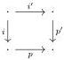
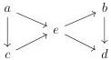
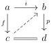

4.1. PRELIMINARIES

Proof. Our goal is to demonstrate that the fibers of  \( \operatorname{Arr}_{L'}(C) \times_{C} \operatorname{Arr}_{R'}(C) \to \operatorname{Arr}(C) \)  are contractible. Let f be a morphism of C. As we have a weak factorization system, there exists an element in the fiber at f. Suppose given two elements in this fiber. This corresponds to a square

Morphisms between these two factorizations correspond to lifts in the previous square, which are contractible by assumption, and the fiber is then contractible.

We recall that in this section, we suppose that we have a factorization system in  \( (L, R) \) .

Lemma 4.1.2.8. Morphisms in L have the unique left lifting property with respect to morphisms in R.

Proof. Let  \( i : a \to c \)  be a morphim of L and  \( p : b \to d \)  a morphism of R. The factorization functor induces an equivalence between squares  \( s \in \operatorname{Sq}(i, p) \)  and diagrams of shape

where all the morphisms of the left triangle are in L and the ones of the right triangle are in R. Such diagrams are then in equivalence between composite  \( c \rightarrow e \rightarrow b \)  where the first morphism is in S and the second in R. Using once again the factorization functor, we can see that this data is exactly equivalent to a lift in the square s. □

We now show the converse of the previous lemma.

Lemma 4.1.2.9. A morphism having the unique left lifting property against morphisms of R is in L. Analogously, a morphism having the unique right lifting property against morphisms of L is in R.

Proof. Let f be a morphism having the unique left lifting property against morphisms in R. We factorize the morphism f in  \( i \in L \)  followed by  \( p \in R \)  and we want to produce an equivalence  \( f \sim i \) . The previous data induces by construction a square

179