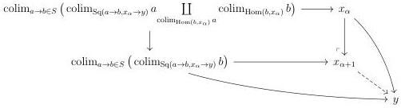
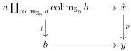
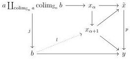

CHAPTER 4. THE \((\infty,1)\)-CATEGORY OF \((\infty,\omega)\)-CATEGORIES

4.1.2.13. We fix an  \( \infty \) -groupoid S of arrows of C with U-small domain and codomain. We define  \( L_{S} := \widehat{S} \) , i.e as the smallest full sub  \( \infty \) -groupoid of arrows of C stable under colimits, composition and including S, and  \( R_{S} \)  as the full sub  \( \infty \) -groupoid of arrows of C having the unique right lifting property against morphisms of S.

Construction 4.1.2.14 (Small object Argument). Let \( f: x \to y \) be an arrow. We define by induction on \( \mathbf{U} \) a sequence \( \{x_{\alpha}\}_{\alpha < \mathbf{U}} \) sending \( \emptyset \) on \( x \). For a limit ordinal \( \alpha < \mathbf{U} \), we set \( x_{\alpha} := \operatorname{colim}_{\alpha' < \alpha} x_{\alpha'} \). For a successor ordinal, we define \( x_{\alpha + 1} \) as the pushout:

Let \( i: x \to \tilde{x} \) be the transfinite composition of this sequence. There is an induced morphism \( p: \tilde{x} \to y \), and an equivalence \( f \sim pi \).

Proposition 4.1.2.15. The previous construction defines a factorization system between \( L_{S} \) and \( R_{S} \).

Proof. Let  \( f : x \to y \)  be any morphism. The previous construction produces functorially morphisms  \( i : x \to \tilde{x} \)  and  \( p : \tilde{x} \to y \)  whose composite is f. The morphism i is obviously in  \( L_{S} \) . We then need to show that p has the unique right lifting property against any morphism of  \( L_{S} \) . Let  \( j : a \to b \)  be any morphism in  \( L_{S} \) , n an integer and consider a commutative square

By stability by \(\omega\)-small colimits, the object \(a \coprod_{\mathrm{colim}_{\mathbb{S}_n} a} \mathrm{colim}_{\mathbb{S}_n} b\) is \(\mathbf{U}\)-small. There exists then \(\alpha < \mathbf{U}\) such that the top morphism factors through \(x_\alpha\), and by construction there exists a morphism \(l: b \to x_{\alpha+1}\) and a comutative square

182