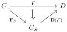

4.1. PRELIMINARIES

The induced diagonal is a lift in the first square. This implies that $\operatorname{Hom}(b, x) \to \operatorname{Sq}(j, p)$ has the right lifting property against $\mathbb{S}_n \to 1$. Eventually, this implies that $\operatorname{Hom}(b, x) \to \operatorname{Sq}(j, p)$ is an equivalence of $\infty$-groupoid, and $p$ then has the unique right lifting property against $i$. We then have a weak factorization system, which is a factorization system according to lemma 4.1.2.7.

### 4.1.3 Reflexive localization

4.1.3.1. An object $x$ is $S$-local if for any $i : a \to b \in S$, the induced functor $\operatorname{Hom}(i, x) : \operatorname{Hom}(b, x) \to \operatorname{Hom}(a, x)$ is an equivalence. We define $C_S$ as the full sub $(\infty, 1)$-category of $C$ composed of $S$-local objects.

Lemma 4.1.3.2. An object is $S$-local if and only if $x \to 1$ is in $R_S$.

Proof. Let $i \in S$. Remark that the functor $\operatorname{Hom}(b, x) \to \operatorname{Sq}(i, x \to 1) \sim \operatorname{Hom}(a, x)$ is $\operatorname{Hom}(i, f)$. The proposition 4.1.2.10 then implies the desired result.

Theorem 4.1.3.3. The inclusion $\iota : C_S \to C$ is part of an adjunction

$$\mathbf{F}_S : C \xrightarrow[\downarrow]{} C_S : \iota$$

Moreover, $\mathbf{F}_S : C \to C_S$ is the localization of $C$ by $\widehat{S}$.

Proof. For an object $x$, the small object argument provides a factorization of $x \to 1$ into a morphism $x \to \mathbf{F}_S x$ of $L_S$ followed by a morphism $\mathbf{F}_S x \to 1$ in $R_S$. According to lemma 4.1.3.2, $\mathbf{F}_S x$ is in $C_S$. As the factorization is functorial, this defines a functor $\mathbf{F}_S : C \to C_S$, and a natural transformation $\nu : id \to \mathbf{F}_S$ constant on $S$-local objects. As $\mathbf{F}_S \iota$ is equivalent to the identity, this induces the claimed adjunction.

For the second proposition, let $F : C \to D$ be a functor sending morphisms of $L_S$ on equivalences. We define $\mathbf{D}(F) := F \circ \iota$, and we have a diagram

that commutes up to the natural transformation $F \circ_0 \nu : F \to D(F) \circ \mathbf{F}_S$. However, the natural transformation $\nu$ is pointwise in $L_S$, which implies that $F \circ \nu$ is pointwise an equivalence, and the previous diagram then commutes. Now, let $G : C_S \to D$ be any other functor such that $G \circ \mathbf{F}_S \sim F$. By precomposing with iota, this implies that $G \sim F \circ \iota$.

183