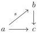

CHAPTER 4. THE \((\infty,1)\)-CATEGORY OF \((\infty,\omega)\)-CATEGORIES

Corollary 4.1.3.4. The  \( (\infty,1) \) -category  \( C_{S} \)  is cocomplete. Moreover, if  \( F:C\to D \)  is a colimit preserving functor sending S onto equivalences, the induced functor  \( DF:C_{S}\to D \)  preserves colimits.

Proof. The first assertion is a direct consequence of the adjunction given in theorem 4.1.3.3.

This adjunction also implies that the colimit of a functor  \( G: A \to C_{S} \)  is given by  \( \mathbf{F}_{S}(\operatorname{colim}_{a:A} \iota G(a)) \) . As the canonical morphism  \( \operatorname{colim}_{a:A} \iota G(a) \to \mathbf{F}_{S}(\operatorname{colim}_{a:A} \iota G(a)) \)  is by construction in  \( \widehat{S} \)  this proves the second assertion. ☐

4.1.3.5. Suppose given an adjunction between two \((\infty, 1)\)-categories

\[
F: C \xrightarrow [ \leftarrow ]{\perp} D: G
\]

with unit  \( \nu \)  and counit  \( \epsilon \) , as well as an  \( \infty \) -groupoid of morphisms S of C and T of D such that  \( F(S) \subset \widehat{T} \) . By adjunction property, it implies that for any T-local object  \( d \in D \) ,  \( G(d) \)  is S-local. The previous adjunction induces a derived adjunction

\[
\mathbf {L} F: C _ {S} \xrightarrow [ \leftarrow ]{\perp} D _ {T}: \mathbf {R} G
\]

where \(\mathbf{L}F\) is defined by the formula \(c\mapsto \mathbf{F}_T F(c)\) and \(\mathbf{R}G\) is the restriction of \(G\) to \(D_{T}\). The unit is given by \(\nu \circ \mathbf{F}_S\) and the counit by the restriction of \(\epsilon\) to \(D_{T}\).

Example 4.1.3.6. Let C be a presentable  \( (\infty,1) \) -category, S a full sub  \( \infty \) -groupoid of morphisms of  \( \mathrm{Psh}^{\infty}(A) \)  with U-small codomain and domain. Eventually, we set  \( S_{/c} \)  as the  \( \infty \) -groupoid of morphisms of shape

where s : S.

A morphism \( f: c \to d \) induces an adjunction

\[
f _ {!}: C _ {/ c} \xrightarrow [ \leftarrow ]{\perp} C _ {/ d}: f ^ {*}
\]

where the left adjoint is the composition and the right adjoint is the pullback. By construction,  \( f_{!}(S_{/c}) \subset S_{/d} \) . The previous adjunction can then be derived, and induced an adjunction:

\[
\mathbf {L} f _ {!}: (C _ {/ c}) _ {S _ {/ c}} \xrightarrow [ \leftarrow ]{\perp} (C _ {/ d}) _ {S _ {/ d}}: \mathbf {R} f ^ {*}
\]

where the right adjoint is just the restriction of  \( f^{*} \)  to  \( S_{/d} \) -local objects.

184