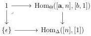
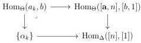

4.2. BASIC CONSTRUCTIONS

Lemma 4.2.1.10. A functor is an equivalence if it has the unique right lifting property against \(\emptyset \to \mathbf{D}_n\) for any \(n \geq 0\).

Proof. This is a necessary condition. For the converse, let  \( f : C \to D \)  be a morphism fulfilling this condition. By definition of left unique lifting property, it implies that the induced morphism  \( f_{n} : C_{n} \to D_{n} \)  is an equivalence for any  \( n \geq 0 \) . Using proposition 4.2.1.9, f is an equivalence. □

4.2.1.11. Let  \( \mathrm{Psh}^{\infty}(\Theta)_{\bullet,\bullet} \)  be the  \( (\infty,1) \) -category of  \( \infty \) -presheaves on  \( \Theta \)  with two distinguished points, i.e. of triples  \( (C,a,b) \)  where a and b are elements of  \( C_{0} \) . The functor  \( [\_,1]:\Theta\to\mathrm{Psh}^{\infty}(\Theta)_{\bullet,\bullet} \)  that sends a onto  \( ([a,1],\{0\},\{1\}) \)  induces by extension by colimit an adjunction

\[
[ \_, 1 ]: \mathrm{Psh} ^ {\infty} (\Theta) \xrightarrow [ \leftarrow ]{\perp} \mathrm{Psh} ^ {\infty} (\Theta) _ {\bullet , \bullet}: \hom_ {-} (\_, \_) \tag {4.2.1.12}
\]

As the left adjoint preserves representables, the right adjoint commutes with colimit. It is then easy to check on representables that the unit of this adjunction is an equivalence. As a consequence, the left adjoint is fully faithful.

Lemma 4.2.1.13. Let C be an  \( \infty \) -presheaves on  \( \Theta \) . The canonical morphisms

\[
C \to \hom_ {[ C, 1 ]} (0, 1) \quad \hom_ {[ C, 1 ]} (0, 0) \to 1 \quad \hom_ {[ C, 1 ]} (1, 1) \sim 1 \quad \emptyset \to \hom_ {[ C, 1 ]} (1, 0)
\]

are equivalences.

Proof. As both hom and  \( [\_,1] \)  preserve colimits, it is sufficient to check this property on representables, where it is an easy computation. □

Proposition 4.2.1.14. The functor \([\_, 1] : \mathrm{Psh}^{\infty}(\Theta) \to \mathrm{Psh}^{\infty}(\Theta)\) preserves \((\infty, \omega)\)-categories.

Proof. By construction, for any pair of integers \( k < n \), and any pair of globular sums \( ([\mathbf{a}, n], b) \), we have cartesian squares

where \(\epsilon\) denote any constant functor with value 0 or 1, and \(\alpha_{k}\) the morphism that sends \(k\) on 0 and \(k + 1\) on 1. Let \(C\) be an \((\infty, \omega)\)-category. As the \((\infty, 1)\)-category \(\infty\)-grd is

187