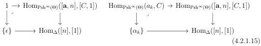
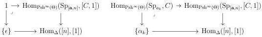
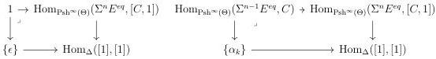

CHAPTER 4. THE \((\infty,1)\)-CATEGORY OF \((\infty,\omega)\)-CATEGORIES

locally cartesian closed, we have cartesian squares

which induces cartesian squares

This directly implies that \([C,1]\) is \(\mathrm{W_{Seg}}\)-local.

Furthermore, for any integer \( n > 0 \), the cartesian squares (4.2.1.15) induces cartesian squares

which implies that \([C,1]\) is local with respect to \(\Sigma^n E^{eq}\to \Sigma^n 1\).

Eventually, suppose given a diagram of shape

\[
\begin{array}{c} E ^ {e q} \longrightarrow [ C, 1 ] \\ \Big \downarrow \\ 1 \end{array} \tag {4.2.1.16}
\]

The canonical morphism \( E^{eq} \to [C,1] \xrightarrow{\pi} [1] \) then factors through 0 or 1. As the two fibers of \( \pi \) are trivial, the diagram (4.2.1.16) admits a unique lift, which concludes the proof.

4.2.1.17. As \([\_, 1]\) sends W to a subset of M, the functor \(\mathrm{hom}_{-,\_}(\_)\) preserves \((\infty, \omega)\)-categories. Combined with the last proposition, this implies that the adjunction (4.2.1.12) restricts to an adjunction:

\[
[ \_, 1 ]: (\infty , \omega) \text {-cat} \xrightarrow [ \leftarrow ]{\perp} (\infty , \omega) \text {-cat} _ {\bullet , \bullet}: \hom_ {-} (\_, \_) \tag {4.2.1.18}
\]

The left adjoint is the suspension functor.

Proposition 4.2.1.19. Let \(C\) be an \((\infty, \omega)\)-categories. We have natural equivalences

\[
\hom_ {[ C, 1 ]} (0, 1) \sim C \quad \hom_ {[ C, 1 ]} (0, 0) \sim \hom_ {[ C, 1 ]} (1, 1) \sim 1 \quad \hom_ {[ C, 1 ]} (1, 0) \sim \emptyset .
\]

Proof. This is a direct consequence of lemma 4.2.1.13.

188