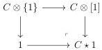
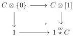
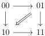
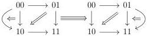

Introduction

Then, we have the Gray cone and Gray o-cone, denoted by \(\_ \star 1\) and \(1 \stackrel{co}{\star} \_\), that send an \((0, \omega)\)-category \(C\) onto the following pushouts:

We also present a formula that illustrates the interaction between the suspension and the Gray cylinder. As this formula plays a crucial role in both Part I and Part II, we provide its intuition at this stage.

If \( A \) is any \( (0, \omega) \)-category, the suspension of \( A \), denoted by \( [A, 1] \), is the \( (0, \omega) \)-category having two objects - denoted by 0 and 1- and such that

\[
\operatorname{Hom} _ {[ A, 1 ]} (0, 1) := A, \quad \operatorname{Hom} _ {[ A, 1 ]} (1, 0) := \emptyset , \quad \operatorname{Hom} _ {[ A, 1 ]} (0, 0) = \operatorname{Hom} _ {[ A, 1 ]} (1, 1) := \{i d \}.
\]

We also define  \( [1] \vee [A,1] \)  as the gluing of [1] and  \( [A,1] \)  along the 0-target of [1] and the 0-source of  \( [A,1] \) . We define similarly  \( [A,1] \vee [1] \) . These two objects come along with whiskerings:

\[
\nabla : [ A, 1 ] \to [ 1 ] \vee [ A, 1 ] \quad \text { and } \quad \nabla : [ A, 1 ] \to [ A, 1 ] \vee [ 1 ]
\]

that preserve the extremal points.

The \((0,\omega)\)-category \([1]\otimes [1]\) is induced by the diagram:

and is then equal to the colimit of the following diagram:

\[
[ 1 ] \vee [ 1 ] \stackrel {\triangledown} {\leftarrow} [ 1 ] \hookrightarrow [ [ 1 ], 1 ] \leftrightarrow [ 1 ] \stackrel {\triangledown} {\rightarrow} [ 1 ] \vee [ 1 ].
\]

The \((0,\omega)\)-category \([1],1]\otimes [1]\) is induced by the diagram:

and is then equal to the colimit of the following diagram:

\[
[ 1 ] \vee [ [ 1 ], 1 ] \stackrel {\triangledown} {\leftarrow} [ [ 1 ] \otimes \{0 \}, 1 ] \hookrightarrow [ [ 1 ] \otimes [ 1 ], 1 ] \leftrightarrow [ [ 1 ] \otimes \{1 \}, 1 ] \stackrel {\triangledown} {\rightarrow} [ [ 1 ], 1 ] \vee [ 1 ]
\]

We prove a formula that combines these two examples:

10