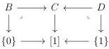
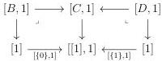
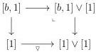
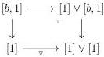

4.2. BASIC CONSTRUCTIONS

Lemma 4.2.1.29. We denote by

\[
[ \_, 1 ] \vee [ 1 ]: (\infty , \omega) \text {-cat} \rightarrow (\infty , \omega) \text {-cat} _ {[ 0 ] \mathrm{II} [ 1 ] /}
\]

\[
(r e s p. [ 1 ] \vee [ \_, 1 ]: (\infty , \omega) \text {-cat} \rightarrow (\infty , \omega) \text {-cat} _ {[ 1 ] \mathrm{II} [ 0 ] /})
\]

the colimit preserving functor that sends an element \(a\) of \(\Theta\) onto the globular sum \([a,1]\vee [1]\) (resp. \([1]\vee [a,1]\)).

The functors \([\_, 1] \vee [\_, 1]\) and \([1] \vee [\_, 1]\) preserve special colimits.

Proof. To prove this, we establish a result analogous to the one given in the proposition 4.2.1.14. We omit its proof because it is long but essentially identical. \(\square\)

Proposition 4.2.1.30. Suppose given two cartesian squares

The diagram

\[
[ 1 ] \vee [ B, 1 ] \xleftarrow {\nabla} [ B, 1 ] \longrightarrow [ C, 1 ] \longleftarrow [ D, 1 ] \xrightarrow {\nabla} [ D, 1 ] \vee [ 1 ]
\]

has a special colimit.

Proof. Remark firsts that the colimit, computed in \(\mathrm{Psh}^{\infty}(\Theta)\), of the diagram

\[
[ 1 ] \vee [ 1 ] \xleftarrow {\nabla} [ 1 ] \xrightarrow {[ \{0 \} , 1 ]} [ [ 1 ], 1 ] \xleftarrow {[ \{1 \} , 1 ]} [ 1 ] \xrightarrow {\nabla} [ 1 ] \vee [ 1 ]
\]

is strict. We leave it to the reader to check that the previous diagram has a special colimit.

Remark now that \(\Theta\) is stable by pullback and \([\_, 1]\) preserves cartesian squares in \(\Theta\). The lemma 4.2.1.28 states that \([\_, 1]\) preserves special colimit, and as \(\mathrm{Psh}^{\infty}(\Theta)\) is locally cartesian closed, pullbacks also preserve them. As every \((\infty, \omega)\)-category is a special colimit of representables, this implies that the squares

are cartesian. Furthermore, for any globular sum \( b \), we have cartesian squares

191