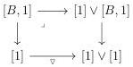
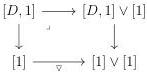
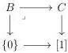

CHAPTER 4. THE \((\infty,1)\)-CATEGORY OF \((\infty,\omega)\)-CATEGORIES

According to lemma 4.2.1.29, \([\_, 1] \vee [1]\) and \([1] \vee [\_, 1]\) preserve special colimits. As every \((\infty, \omega)\)-category is a colimit of representables, this implies that the squares

are cartesian. The result then follows from proposition 4.2.1.24.

Proposition 4.2.1.31. Suppose given a cartesian square

The diagram

\[
[ 1 ] \vee [ B, 1 ] \xleftarrow {\triangledown} [ B, 1 ] \longrightarrow [ C, 1 ]
\]

has a special colimit.

Proof. The proof is similar to the previous one.

##### 4.2.1.32. We have an adjunction

\[
i _ {!}: \mathrm{Psh} ^ {\infty} (\Delta [ \Theta_ {n - 1} ]) \xrightarrow [ \longleftarrow ]{} \mathrm{Psh} ^ {\infty} (\Theta_ {n}): i ^ {*} \tag {4.2.1.33}
\]

where the left adjoint is the left Kan extension of the functor  \( \Delta[\Theta_{n-1}] \xrightarrow{i} \Theta_n \to \mathrm{Psh}^\infty(\Theta_n) \) . We recall that the sets of morphisms  \( W_n \)  and  \( M_n \)  are respectively defined in paragraphs 1.1.2.14 and 1.1.2.15. Remark that there is an obvious inclusion  \( i_!(\mathrm{M}_n) \subset \mathrm{W}_n \) . The previous adjunction then induced a derived adjunction

\[
\mathbf {L} i _ {!}: \mathrm{Psh} (\Delta [ \Theta_ {n - 1} ]) _ {\mathrm{M}} \xrightarrow [ \longleftarrow ]{} \mathrm{Psh} (\Theta_ {n}) _ {\mathrm{W}}: \mathbf {R} i ^ {*} \tag {4.2.1.34}
\]

Proposition 4.2.1.35. The unit and counit of the adjunction (4.2.1.33) are respectively in \(\widehat{\mathrm{M}}_n\) and \(\widehat{\mathrm{W}}_n\). As a consequence, the adjunction (4.2.1.34) is an adjoint equivalence.

Proof. We denote by \(\iota : \mathrm{Psh}(\Theta_n) \to \mathrm{Psh}^\infty(\Theta_n)\) and \(\iota : \mathrm{Psh}(\Delta[\Theta_{n-1}]) \to \mathrm{Psh}^\infty(\Delta[\Theta_{n-1}])\) the two canonical inclusions. By the definition of the smallest precocomplete class (paragraph 1.1.3.1) and according to lemma 4.1.1.6, we have inclusions \(\iota(\overline{\mathrm{W}_n}) \subset \widehat{\mathrm{W}_n}\) and \(\iota(\overline{\mathrm{M}_n}) \subset \widehat{\mathrm{M}_n}\). The result then directly follows from theorem 1.1.3.3.

192