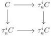
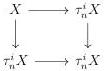

CHAPTER 4. THE \((\infty,1)\)-CATEGORY OF \((\infty,\omega)\)-CATEGORIES

Proof. As  \( i_{n} \)  preserves representable objects, the functor  \( \tau_{n}:(\infty,\omega) \) -cat  \( \rightarrow(\infty,n) \) -cat preserves special colimits. As  \( i_{n}:\mathrm{Psh}^{\infty}(\Theta_{n})\rightarrow\mathrm{Psh}^{\infty}(\Theta) \)  preserves colimits and W-local objects, this concludes the proof. ☐

Proposition 4.2.1.42. Let \( C \) be an \( (\infty, \omega) \)-category and \( n \) an integer. The following canonical square is cartesian

Proof. For this results we use model categories. The theorem 3.4.3.14 implies that the \((\infty, 1)\)-category \((\infty, \omega)\)-cat is presented by the category of marked simplicial sets \(\mathrm{mPsh}(\Delta)\) endowed with the model structure for \(\omega\)-complicial sets given by proposition 2.2.1.9, and the functor \(\tau_n^i: (\infty, \omega)\)-cat \(\to (\infty, \omega)\)-cat corresponds to the left Quillen functor \(\tau_n^i: \mathrm{mPsh}(\Delta) \to \mathrm{mPsh}(\Delta)\) given in paragraph 2.2.1.10. Remark that in this model category, for any marked simplicial set \(X\), the following square is cocartesian

As all the morphisms are cofibrations, this square is also homotopy cocartesian which concludes the proof.

4.2.1.43. The family of truncation functor induces a sequence

\[
\dots \to (\infty , n + 1) \text {-cat} \xrightarrow {\tau_ {n}} (\infty , n) \text {-cat} \to \dots \to (\infty , 1) \text {-cat} \xrightarrow {\tau_ {0}} (\infty , 0) \text {-cat}
\]

which induces an adjunction

\[
\operatorname{colim} _ {n: \mathbb {N}}: \lim _ {n: \mathbb {N}} (\infty , n) \text {-cat} \xrightarrow [ \leftarrow ]{\perp} (\infty , \omega) \text {-cat}: (\tau_ {n}) _ {n: \mathbb {N}} \tag {4.2.1.44}
\]

where the left adjoint sends a sequence  \( (C_{n}, C_{n} \sim \tau_{n} C_{n+1})_{n:\mathbb{N}} \)  to the colimit of the induced sequence

\[
i _ {0} C _ {0} \rightarrow i _ {1} C _ {1} \rightarrow \dots \rightarrow i _ {n} C _ {n} \rightarrow \dots ,
\]

and the right adjoint sends an \((\infty, \omega)\)-category \(C\) to the sequence \((\tau_n C, \tau_n C \sim \tau_n \tau_{n+1} C)_{n:\mathbb{N}}\). Indeed, we have equivalence

\[
\begin{array}{l} \operatorname{Hom} \left(\operatorname{colim} _ {n: \mathbb {N}} i _ {n} C _ {n}, D\right) \sim \lim _ {n: \mathbb {N}} \operatorname{Hom} \left(C _ {n}, \tau_ {n} D\right) \\ \sim \mathrm{Hom} ((C _ {n}, C _ {n} \sim \tau_ {n} C _ {n + 1}) _ {n: \mathbb {N}}, (\tau_ {n} D, \tau_ {n} D \sim \tau_ {n} \tau_ {n + 1} D) _ {n: \mathbb {N}}) \\ \end{array}
\]

natural in \((C_n, C_n \sim \tau_n C_{n+1})_{n:\mathbb{N}}\) and \(D\).

194